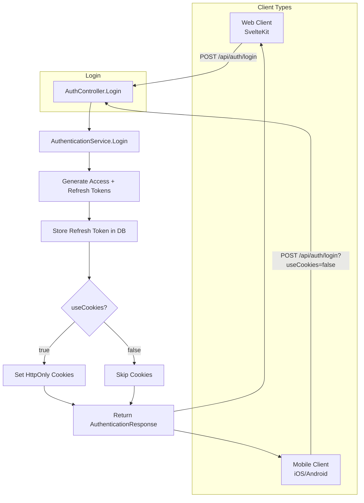
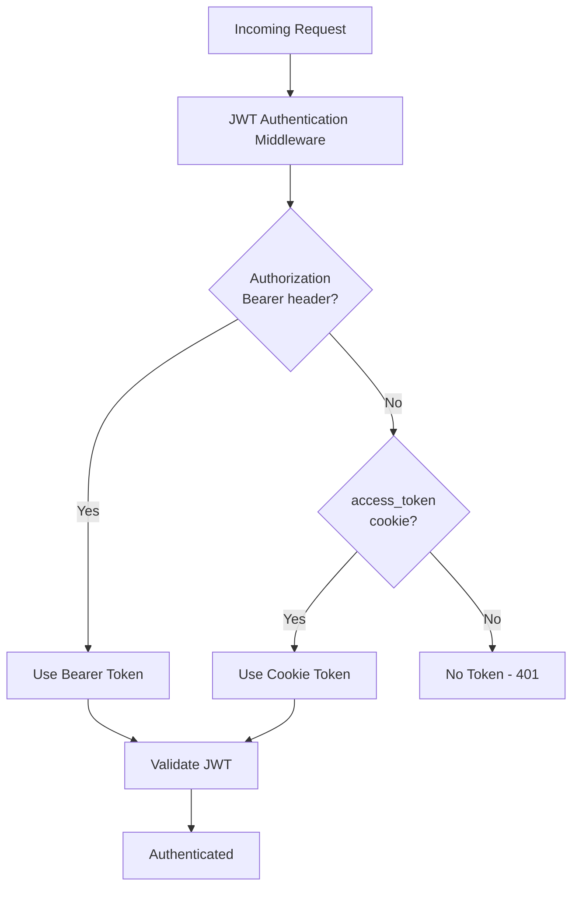

# Dual Authentication: Bearer Token + Cookie Support

**Date**: 2026-02-07
**Scope**: Add Bearer token authentication for mobile clients alongside existing cookie-based auth for web

## Summary

Implemented dual authentication support allowing the API to serve both web clients (SvelteKit via HttpOnly cookies) and mobile clients (iOS/Android via Bearer tokens). Added a `useCookies` query parameter so mobile clients can opt out of cookie handling entirely. Updated OpenAPI spec with Bearer auth security scheme.

## Changes Made

| File | Change | Reason |
|------|--------|--------|
| `Application/.../Dtos/AuthenticationOutput.cs` | New record DTO with `AccessToken` and `RefreshToken` | Return tokens from service layer |
| `Application/.../IAuthenticationService.cs` | Changed `Login` and `RefreshTokenAsync` to return `Result<AuthenticationOutput>`, added `useCookies` param | Expose tokens to callers, allow cookie opt-out |
| `Infrastructure/.../ServiceCollectionExtensions.cs` | JWT `OnMessageReceived` checks Bearer header first, falls back to cookie | Support both auth methods with priority |
| `Infrastructure/.../AuthenticationService.cs` | Return tokens in result, conditionally set cookies based on `useCookies` | Enable Bearer auth, respect client preference |
| `WebApi/.../AuthController.cs` | Return `AuthenticationResponse` in body, accept `RefreshRequest` body, add `useCookies` query param | Mobile clients need tokens in response, flexible auth |
| `WebApi/.../AuthMapper.cs` | Added `ToResponse()` extension method | Map Application DTO to WebApi response |
| `WebApi/.../Dtos/Login/AuthenticationResponse.cs` | New response DTO with token fields | Typed response for OAS generation |
| `WebApi/.../Dtos/Login/RefreshRequest.cs` | New request DTO with optional `RefreshToken` | Allow body-based refresh for mobile |
| `WebApi/.../Transformers/ProjectDocumentTransformer.cs` | Added `bearerAuth` security scheme, updated API description | Document Bearer auth in OpenAPI spec |

## Decisions & Reasoning

### Token Expiration in Response

- **Choice**: Removed `AccessTokenExpiresInSeconds` and `RefreshTokenExpiresInSeconds` from response
- **Alternatives considered**: Include expiration fields, return `DateTime` instead of seconds
- **Reasoning**: Mobile clients can decode the JWT to get the `exp` claim - this is standard practice. Reduces response size and avoids potential clock sync issues.

### `useCookies` Query Parameter

- **Choice**: Add `?useCookies=false` query parameter (defaults to `true`)
- **Alternatives considered**: Separate endpoints (`/login/cookie`, `/login/token`), header-based detection, auto-detect from User-Agent
- **Reasoning**: Follows ASP.NET Core Identity's established pattern. Explicit opt-out is cleaner than auto-detection. Single endpoint is simpler than duplication.

### Auth Priority: Bearer First

- **Choice**: Check `Authorization: Bearer` header first, fall back to cookie
- **Alternatives considered**: Cookie first, require explicit header for Bearer
- **Reasoning**: Bearer header is explicit intent - if a client sends it, they want Bearer auth. Cookie is the implicit fallback for web clients that don't send headers.

## Diagrams

### Authentication Flow



### Request Authentication



## API Examples

### Web Client (Cookie-based)

```bash
# Login - cookies are set automatically
curl -X POST http://localhost:8080/api/auth/login \
  -H "Content-Type: application/json" \
  -d '{"username": "user@example.com", "password": "password"}' \
  -c cookies.txt

# Subsequent requests use cookies
curl http://localhost:8080/api/v1/users/me -b cookies.txt

# Refresh - reads token from cookie
curl -X POST http://localhost:8080/api/auth/refresh -b cookies.txt -c cookies.txt
```

### Mobile Client (Bearer-based)

```bash
# Login - no cookies
curl -X POST "http://localhost:8080/api/auth/login?useCookies=false" \
  -H "Content-Type: application/json" \
  -d '{"username": "user@example.com", "password": "password"}'
# Response: {"accessToken": "eyJ...", "refreshToken": "abc123"}

# Subsequent requests use Bearer header
curl http://localhost:8080/api/v1/users/me \
  -H "Authorization: Bearer eyJ..."

# Refresh - pass token in body
curl -X POST "http://localhost:8080/api/auth/refresh?useCookies=false" \
  -H "Content-Type: application/json" \
  -d '{"refreshToken": "abc123"}'
```

## Follow-Up Items

- [ ] Add integration tests for Bearer token authentication flow
- [ ] Add integration tests for `useCookies=false` behavior
- [ ] Consider adding rate limiting specific to auth endpoints
- [ ] Document auth flows in API docs or README for mobile developers
