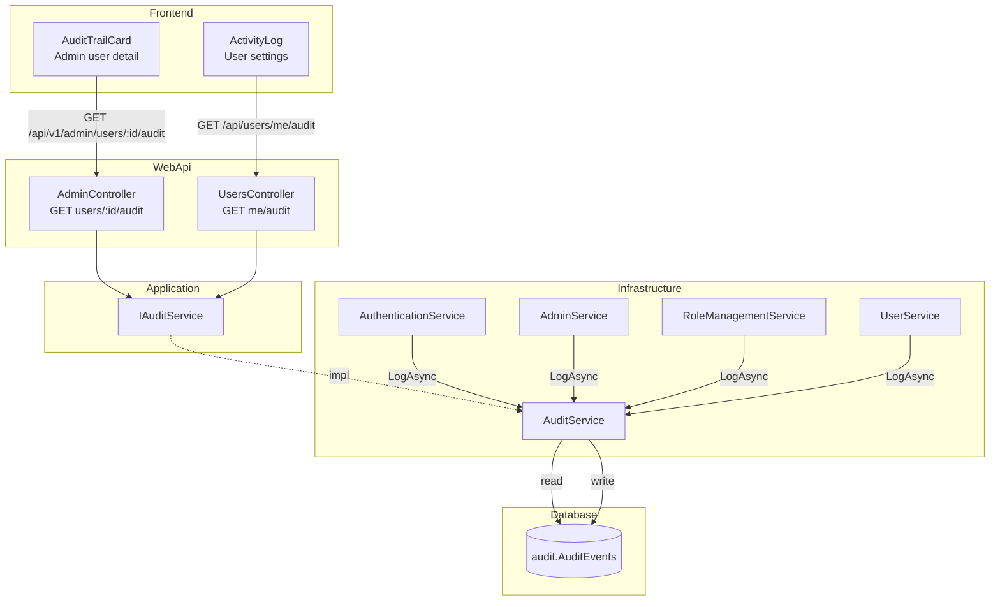
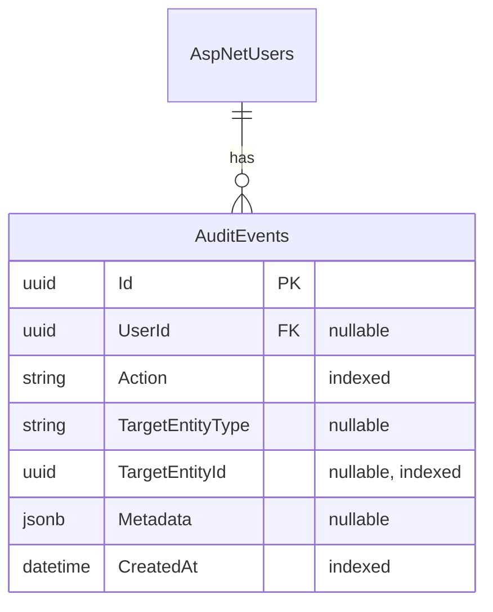

# Full-Stack Audit Trail

**Date**: 2026-02-18
**Scope**: Append-only audit logging for authentication, user management, admin, and role operations with admin and user-facing UI

## Summary

Added a comprehensive audit trail system spanning the entire stack. Every significant user and admin action is now recorded in a dedicated `audit.AuditEvents` table with optional JSONB metadata. Admins can view per-user audit trails from the user detail page, and regular users can see their own activity log in settings.

## Changes Made

| File | Change | Reason |
|------|--------|--------|
| `Application/Features/Audit/IAuditService.cs` | New service interface with `LogAsync` and `GetUserAuditEventsAsync` | Define audit contract in Application layer |
| `Application/Features/Audit/AuditActions.cs` | Static class with 25+ action constants | Type-safe audit action identifiers |
| `Application/Features/Audit/Dtos/` | `AuditEventOutput`, `AuditEventListOutput` records | Application-layer DTOs for audit data |
| `Infrastructure/Features/Audit/Models/AuditEvent.cs` | Entity with UserId, Action, TargetEntity*, Metadata, CreatedAt | Append-only audit log storage |
| `Infrastructure/Features/Audit/Configurations/` | EF Core config with indexes on UserId, Action, CreatedAt | Query performance for per-user and per-action lookups |
| `Infrastructure/Features/Audit/Services/AuditService.cs` | Internal sealed service with exception-safe logging | Never throws — failures only logged |
| `Infrastructure/Features/Audit/Extensions/` | DI registration via C# 13 extension syntax | Service wiring |
| `Infrastructure/Features/Admin/Services/AdminService.cs` | Added audit calls to all admin user operations | Track admin create/lock/unlock/delete/verify/reset/role actions |
| `Infrastructure/Features/Admin/Services/RoleManagementService.cs` | Added audit calls to role CRUD + permissions | Track role management actions |
| `Infrastructure/Features/Authentication/Services/AuthenticationService.cs` | Added audit calls to auth flows | Track login/logout/register/password/email actions |
| `Infrastructure/Identity/Services/UserService.cs` | Added audit calls to profile update and account deletion | Track self-service user actions |
| `Infrastructure/Persistence/MyProjectDbContext.cs` | Added `DbSet<AuditEvent>` | EF Core model registration |
| `WebApi/Features/Audit/` | Response DTOs, mapper, request/response for pagination | API layer types and mapping |
| `WebApi/Features/Admin/AdminController.cs` | New `GET users/{id}/audit` endpoint | Admin audit trail access |
| `WebApi/Features/Users/UsersController.cs` | New `GET me/audit` endpoint | User's own activity log |
| `WebApi/Program.cs` | `AddAuditServices()` call | Wire audit into DI |
| `tests/*` | Mock setup in factory, IAuditService injection in service tests | Test infrastructure for audit dependency |
| `frontend/src/lib/api/v1.d.ts` | Added `AuditEventResponse`, `ListAuditEventsResponse` schemas and path definitions | OpenAPI type definitions for new endpoints |
| `frontend/src/lib/components/admin/AuditTrailCard.svelte` | New component: paginated audit table for admin user detail | Admin can review user activity |
| `frontend/src/lib/components/settings/ActivityLog.svelte` | New component: paginated audit table for user settings | Users can review own activity |
| `frontend/src/messages/en.json`, `cs.json` | 25+ i18n keys for audit actions and UI labels | Localized action names and column headers |
| `frontend/src/routes/(app)/admin/users/[id]/+page.svelte` | Render `<AuditTrailCard>` | Integrate into admin user detail |
| `frontend/src/routes/(app)/settings/+page.svelte` | Render `<ActivityLog>` | Integrate into user settings |

## Decisions & Reasoning

### Append-only entity (not extending BaseEntity)

- **Choice**: `AuditEvent` is a standalone entity with its own `Id` and `CreatedAt`, not extending `BaseEntity`
- **Alternatives considered**: Extending `BaseEntity` with soft-delete and audit fields
- **Reasoning**: Audit logs must never be soft-deleted or updated. An append-only model is simpler, safer, and avoids circular audit-of-audit scenarios. No `UpdatedAt`/`DeletedAt` fields needed.

### Fire-and-forget logging (never throws)

- **Choice**: `AuditService.LogAsync` catches all exceptions and logs them via `ILogger`
- **Alternatives considered**: Letting exceptions propagate, or using a background queue
- **Reasoning**: Audit instrumentation must never break the primary operation. If DB write fails, the user action still succeeds. A background queue adds complexity without clear benefit at this scale.

### Separate endpoints for admin vs. self

- **Choice**: `GET /api/v1/admin/users/{id}/audit` (permission-gated) and `GET /api/users/me/audit` (authenticated)
- **Alternatives considered**: Single endpoint with conditional logic
- **Reasoning**: Follows existing pattern (admin vs. user controllers). Clear authorization boundaries — admin endpoint requires `Users.View` permission, self endpoint requires only authentication.

### JSONB metadata field

- **Choice**: Optional `string? Metadata` column stored as JSONB in PostgreSQL
- **Alternatives considered**: Structured columns for every possible metadata field, or a separate key-value table
- **Reasoning**: Different actions need different context (role name, target user, IP address). JSONB is flexible and queryable in PostgreSQL without schema changes per action type.

## Diagrams

## Follow-Up Items

- [ ] Regenerate `v1.d.ts` from live backend (manual types added as placeholder)
- [ ] Add audit event cleanup job (Hangfire) to prune old records
- [ ] Consider adding IP address / user agent to metadata for security-sensitive actions
- [ ] Add API integration tests for both audit endpoints
