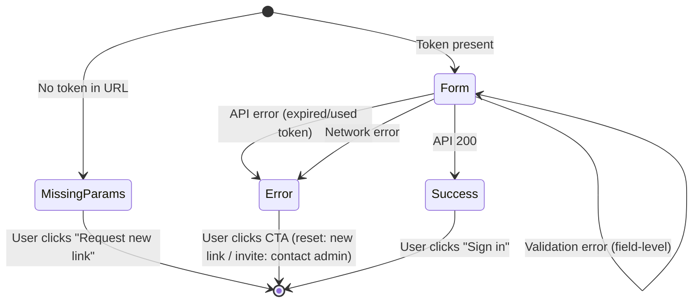

# Improve Email Link Flow UX

**Date**: 2026-02-18
**Scope**: Reset-password page error handling and invitation-aware copy

## Summary

Replaced the auto-dismissing toast notification on reset-password failure with a persistent error card (matching the verify-email page pattern). Added invitation-aware copy so invited users see "Set your password" instead of "Reset your password". Added a backend guard to reject same-password resets.

## Changes Made

| File | Change | Reason |
|------|--------|--------|
| `src/backend/MyProject.Shared/ErrorMessages.cs` | Added `PasswordSameAsCurrent` constant | Reject resetting to the same password |
| `src/backend/MyProject.Infrastructure/Features/Authentication/Services/AuthenticationService.cs` | Added `CheckPasswordAsync` guard before `ResetPasswordAsync` | Prevent no-op password resets; safe for invited users (no hash = returns false) |
| `src/backend/MyProject.Infrastructure/Features/Admin/Services/AdminService.cs` | Appended `&invited=1` to invitation email URL | Lets frontend distinguish invitation from reset (cosmetic only) |
| `src/frontend/src/routes/(public)/reset-password/+page.server.ts` | Added `invited` boolean from URL params | Pass invitation flag to page |
| `src/frontend/src/routes/(public)/reset-password/+page.svelte` | Conditional meta title/description, pass `invited` prop | SEO and component awareness of mode |
| `src/frontend/src/lib/components/auth/ResetPasswordForm.svelte` | Added `isError`/`errorMessage` state, persistent error card, invitation-aware copy | Core UX fix: errors now persist instead of auto-dismissing |
| `src/frontend/src/messages/en.json` | Added 13 new i18n keys for set-password and error states | Support invitation mode and error card copy |
| `src/frontend/src/messages/cs.json` | Added corresponding Czech translations | Full i18n parity |

## Decisions & Reasoning

### Persistent error card vs toast

- **Choice**: Replace toast with a persistent error card that replaces the form
- **Alternatives considered**: Keep toast but make it non-dismissable; show inline error banner above form
- **Reasoning**: Matches the verify-email page pattern already in the codebase. Users with expired/used tokens can't recover by retrying, so keeping the form interactive is misleading.

### Cosmetic `invited` query parameter

- **Choice**: Add `&invited=1` to invitation URLs only — backend ignores it
- **Alternatives considered**: Separate endpoint or token type for invitations; store invitation flag in DB
- **Reasoning**: Minimal change — the token type is already `PasswordReset` for both flows. The `invited` param is purely cosmetic for frontend copy. No backend schema or logic changes needed.

### Same-password check placement

- **Choice**: Check before `ResetPasswordAsync` using `CheckPasswordAsync`
- **Alternatives considered**: Password history table; custom Identity validator
- **Reasoning**: `CheckPasswordAsync` returns false for users with no password hash (invited users), so it naturally allows first-time password setting. No additional storage or configuration needed.

## Diagrams

## Follow-Up Items

- [ ] Manual test: trigger forgot-password flow, submit with expired token, verify persistent error card
- [ ] Manual test: invite user via admin, verify `&invited=1` in URL, verify "Set your password" copy
- [ ] Manual test: submit expired invitation token, verify "contact your administrator" message
