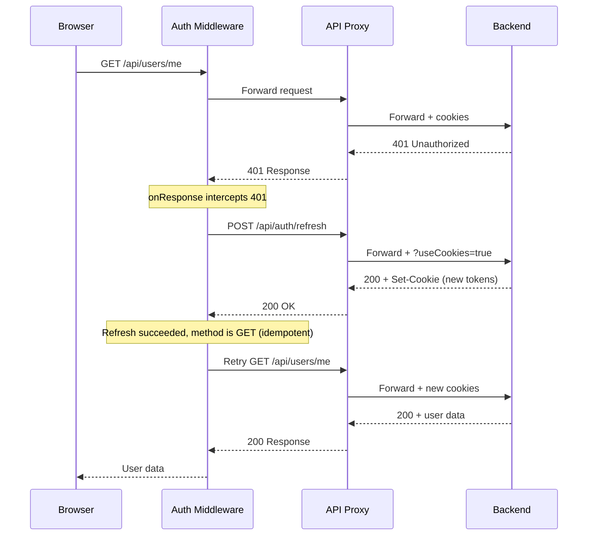
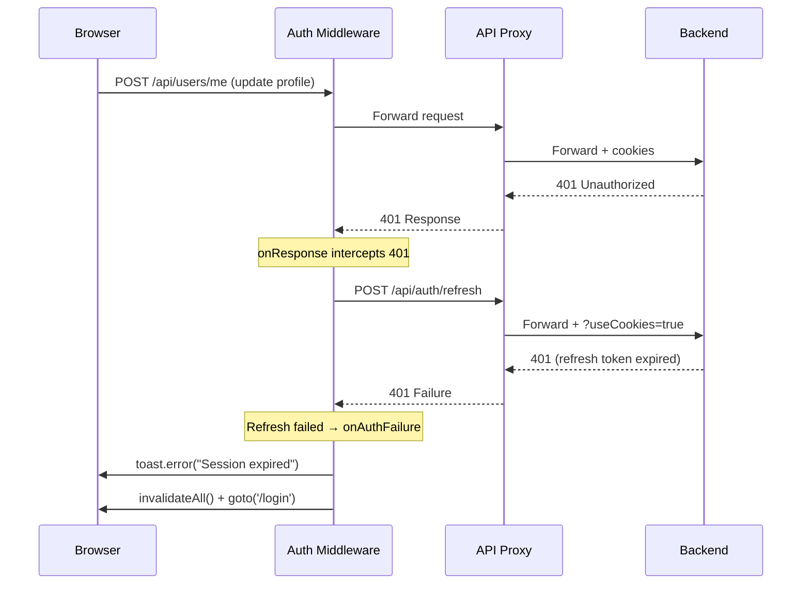

# Refactor Frontend Auth Endpoints

**Date**: 2026-02-21
**Scope**: Frontend authentication client refactoring — middleware-based token refresh, error handling, session expiry UX

## Summary

Replaced the hand-rolled `fetchWithAuth` wrapper in the API client with openapi-fetch's built-in middleware API (`onResponse` hook). This cleanly separates auth concerns from API calls, adds proper session expiry handling with toast notifications and login redirect, and distinguishes backend outages from authentication failures.

## Changes Made

| File | Change | Reason |
|------|--------|--------|
| `src/frontend/src/lib/api/client.ts` | Auth-agnostic client factory — `createApiClient()` accepts `middleware[]`, `browserClient` created bare | Clean separation: API plumbing knows nothing about auth |
| `src/frontend/src/lib/api/index.ts` | Exports `createApiClient`, `browserClient` (no auth exports) | API barrel stays auth-agnostic |
| `src/frontend/src/lib/auth/middleware.ts` | `createAuthMiddleware()` — 401 refresh, retry, failure callback | All auth logic consolidated under `lib/auth/` |
| `src/frontend/src/lib/auth/auth.ts` | `getUser()` now returns `GetUserResult` with `{ user, error }` instead of `User \| null`. Added `GetUserResult` interface. | Distinguish "not authenticated" from "backend unavailable" |
| `src/frontend/src/lib/auth/index.ts` | Added `GetUserResult` type re-export | Barrel export consistency |
| `src/frontend/src/routes/+layout.server.ts` | Destructures `{ user, error }` from `getUser()`, passes `backendError` to children | Propagate backend error state to child layouts |
| `src/frontend/src/routes/(app)/+layout.server.ts` | Added `backendError` check → throws 503 before redirect check | Prevent misleading redirect to login when backend is down |
| `src/frontend/src/routes/+layout.svelte` | Wires `createAuthMiddleware` into `browserClient.use()` in `onMount` with toast + redirect | Auth middleware injected at runtime — no module-level mutable state |
| `src/frontend/src/routes/api/[...path]/+server.ts` | Renamed `COOKIE_AUTH_ENDPOINTS` → `COOKIE_AUTH_PATHS` with expanded docs | Clarity — the list controls `?useCookies=true` injection, not generic auth |
| `src/frontend/src/messages/en.json` | Added `auth_sessionExpired_title` and `auth_sessionExpired_description` | i18n for session expiry toast |
| `src/frontend/src/messages/cs.json` | Added Czech translations for session expiry keys | i18n parity |
| `src/frontend/AGENTS.md` | Updated API Client architecture and Authentication Flow sections | Reflect middleware-based architecture and `backendError` propagation |

## Decisions & Reasoning

### Use openapi-fetch middleware instead of custom fetch wrapper

- **Choice**: Adopted `client.use(middleware)` with `onResponse` hook
- **Alternatives considered**: (a) Switch to `@hey-api/openapi-ts` for a batteries-included SDK with built-in interceptors, (b) Keep the `fetchWithAuth` wrapper but improve it
- **Reasoning**: The project already uses openapi-fetch + openapi-typescript for type generation. The middleware API is a first-class feature of the library since v0.9+. Switching libraries would require migrating 24+ files that import `browserClient`. The middleware approach gave us the exact hooks needed with zero migration cost.

### Only retry idempotent methods after token refresh

- **Choice**: After a successful refresh, only auto-retry GET/HEAD/OPTIONS. Non-idempotent methods (POST/PUT/PATCH/DELETE) return the original 401.
- **Alternatives considered**: Retry all methods, or buffer request bodies for safe replay
- **Reasoning**: Automatically retrying a POST after refresh could cause double-submission (e.g., creating two orders). The caller already has the context to retry manually. This matches industry best practices for auth interceptors.

### Auth middleware wired via `browserClient.use()` in layout

- **Choice**: `browserClient` is created bare at module scope; the root layout calls `browserClient.use(createAuthMiddleware(...))` in `onMount`
- **Alternatives considered**: (a) Module-level `setAuthFailureHandler()` callback pattern, (b) Lazy-initialize `browserClient` via `initBrowserClient()` called from the root layout
- **Reasoning**: 24 files import `browserClient` at the top level. Making it lazy would require null checks or `!` assertions everywhere. Using openapi-fetch's `.use()` lets us keep `browserClient` always defined while injecting auth behaviour at runtime. The failure callback is passed directly as a closure — no module-level mutable state needed.

### Structured `GetUserResult` over nullable `User`

- **Choice**: Return `{ user, error }` from `getUser()` instead of `User | null`
- **Alternatives considered**: Throw errors for backend failures, use separate error codes
- **Reasoning**: `User | null` conflates two very different states: "not logged in" and "backend is down". The structured result lets `(app)/+layout.server.ts` show a 503 error page instead of incorrectly redirecting to login during outages.

## Diagrams

## Follow-Up Items

- [ ] Consider adding a 503 error page (`+error.svelte`) with a "retry" button for backend outage UX
- [ ] Consider adding a loading skeleton or spinner while the refresh attempt is in-flight
- [ ] Monitor whether concurrent 401 deduplication handles edge cases in production (e.g., tab switching, background tabs)
