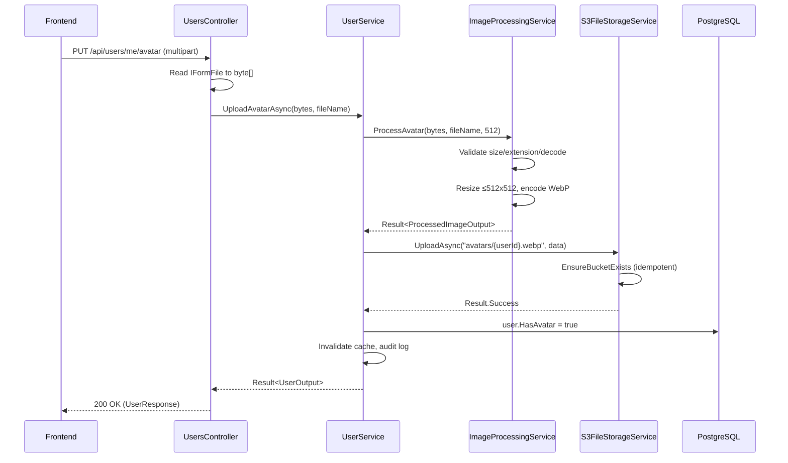

# Avatar File Upload — MinIO/S3 Storage

**Date**: 2026-02-23
**Scope**: Replace URL-based avatars with server-side file upload and S3-compatible blob storage

## Summary

Replaced the tracking-pixel-vulnerable URL-based avatar system with a full file upload pipeline. Users upload images via multipart/form-data, the backend validates and compresses them (SkiaSharp → 512x512 WebP), and stores them in S3-compatible blob storage (MinIO locally, any S3 provider in production). The frontend AvatarDialog was rewritten from a URL input to a drag-and-drop file upload zone with client-side validation and preview.

## Changes Made

| File | Change | Reason |
|------|--------|--------|
| `deploy/docker-compose.yml` | Added `storage` MinIO service with health check, volume, depends_on | S3-compatible local storage |
| `deploy/docker-compose.local.yml` | Exposed ports 13010 (API) and 13012 (console) | Local dev access |
| `deploy/docker-compose.production.yml` | Added hardened storage service (0.5 CPU, 512M) | Production resource limits |
| `deploy/envs/local.env` | Added MINIO_ROOT_USER/PASSWORD, FileStorage config | MinIO credentials |
| `deploy/envs/production.env.example` | Added FileStorage section with S3 examples | Production config template |
| `Directory.Packages.props` | Added AWSSDK.S3 3.7.415.1, SkiaSharp 3.119.2 | NuGet version management |
| `MyProject.Infrastructure.csproj` | Added package references | Project dependencies |
| `Application/Features/FileStorage/IFileStorageService.cs` | Created generic file storage interface | Reusable abstraction |
| `Application/Features/FileStorage/Dtos/FileDownloadOutput.cs` | Created download result record | DTO for file downloads |
| `Application/Features/Avatar/IImageProcessingService.cs` | Created image processing interface | Avatar-specific processing |
| `Application/Features/Avatar/Dtos/ProcessedImageOutput.cs` | Created processing result record | DTO for processed images |
| `Application/Features/Authentication/Dtos/UserOutput.cs` | `AvatarUrl` → `HasAvatar` | No longer exposing external URLs |
| `Application/Features/Authentication/Dtos/UpdateProfileInput.cs` | Removed `AvatarUrl` parameter | Avatar handled by separate endpoint |
| `Application/Features/Admin/Dtos/AdminUserOutput.cs` | `AvatarUrl` → `HasAvatar` | Consistent across admin views |
| `Application/Identity/IUserService.cs` | Added Upload/Remove/GetAvatar methods | Avatar operations on user service |
| `Shared/ErrorMessages.cs` | Added `Avatar` nested class | Standardized error messages |
| `Application/Features/Audit/AuditActions.cs` | Added AvatarUpload, AvatarRemove | Audit trail |
| `Infrastructure/Features/FileStorage/Options/FileStorageOptions.cs` | Created S3 config options with validation | Configuration with ValidateOnStart |
| `Infrastructure/Features/FileStorage/Services/S3FileStorageService.cs` | Created S3 implementation with auto-bucket creation | Core storage logic |
| `Infrastructure/Features/FileStorage/Extensions/ServiceCollectionExtensions.cs` | Created DI registration | C# 13 extension syntax |
| `Infrastructure/Features/Avatar/Services/ImageProcessingService.cs` | Created SkiaSharp image processor | Validate, resize 512x512, encode WebP |
| `Infrastructure/Features/Avatar/Extensions/ServiceCollectionExtensions.cs` | Created DI registration | Singleton (stateless) |
| `Infrastructure/Features/Authentication/Models/ApplicationUser.cs` | `AvatarUrl` → `HasAvatar` | Entity model change |
| `Infrastructure/Identity/Services/UserService.cs` | Added avatar methods, cleanup on delete | Upload/remove/get + cache invalidation |
| `Infrastructure/Features/Admin/Services/AdminService.cs` | `AvatarUrl` → `HasAvatar` mappings | Admin output consistency |
| `WebApi/Features/Users/UsersController.cs` | Added PUT/DELETE/GET avatar endpoints | API surface for avatar operations |
| `WebApi/Features/Users/Dtos/UploadAvatar/*.cs` | Created request DTO and validator | FluentValidation: 5MB, allowed MIME types |
| `WebApi/Features/Users/Dtos/UserResponse.cs` | `AvatarUrl` → `HasAvatar` | Response shape change |
| `WebApi/Features/Users/Dtos/UpdateUserRequest.cs` | Removed `AvatarUrl` property | No longer settable via profile update |
| `WebApi/Features/Users/Dtos/UpdateUserRequestValidator.cs` | Removed `AvatarUrl` rules | Field removed |
| `WebApi/Features/Users/UserMapper.cs` | Updated mapping | HasAvatar boolean |
| `WebApi/Features/Admin/AdminMapper.cs` | Updated mapping | HasAvatar boolean |
| `WebApi/Features/Admin/Dtos/AdminUserResponse.cs` | `AvatarUrl` → `HasAvatar` | Admin response consistency |
| `WebApi/Program.cs` | Wired AddFileStorageServices, AddAvatarServices | DI registration |
| `WebApi/appsettings.Testing.json` | Added FileStorage section | Prevent ValidateOnStart failure in tests |
| `tests/.../ImageProcessingServiceTests.cs` | Created 15 tests | Valid formats, resize, failures |
| `tests/.../FileStorageOptionsValidationTests.cs` | Created 7 tests | Required fields, optional region |
| `tests/.../UserValidatorTests.cs` | Added UploadAvatarRequestValidatorTests | Null/empty/large/invalid/valid files |
| `tests/.../UsersControllerTests.cs` | Added 8 avatar endpoint tests | Upload/remove/get: 200/400/401 |
| `tests/.../AdminControllerTests.cs` | Updated UserOutput constructors | HasAvatar boolean |
| `tests/.../UserServiceTests.cs` | Added mock dependencies | IFileStorageService, IImageProcessingService |
| `tests/.../ResponseContracts.cs` | `AvatarUrl` → `HasAvatar` | Contract alignment |
| `frontend/src/lib/api/v1.d.ts` | Added avatar endpoints, updated schemas | Type definitions for new API |
| `frontend/src/lib/api/error-handling.ts` | Removed AvatarUrl field mapping | Field no longer exists |
| `frontend/.../AvatarDialog.svelte` | Rewritten: URL input → file upload dropzone | Core UX change |
| `frontend/.../ProfileHeader.svelte` | `avatarUrl` → `/api/users/{id}/avatar` | Server-served images |
| `frontend/.../UserNav.svelte` | Same pattern | Consistent avatar display |
| `frontend/src/messages/en.json` | Updated avatar i18n keys | Upload-oriented messages |
| `frontend/src/messages/cs.json` | Updated avatar i18n keys | Czech translations |

## Decisions & Reasoning

### Generic IFileStorageService vs avatar-specific storage

- **Choice**: Generic `IFileStorageService` interface (Upload/Download/Delete/Exists)
- **Alternatives considered**: Avatar-specific storage service
- **Reasoning**: The generic interface is reusable for future file features (document uploads, exports, etc.) without additional abstraction cost

### SkiaSharp for image processing

- **Choice**: SkiaSharp 3.119.2 (Apache 2.0, cross-platform)
- **Alternatives considered**: ImageSharp (Six Labors license restrictions), System.Drawing (Windows-only)
- **Reasoning**: No licensing issues for commercial use, works in Linux Docker containers, handles JPEG/PNG/WebP/GIF decode and WebP encode

### HasAvatar bool vs avatar URL in response

- **Choice**: `HasAvatar` boolean flag, frontend constructs URL via `/api/users/{id}/avatar`
- **Alternatives considered**: Pre-signed S3 URLs in response, base64 inline
- **Reasoning**: Eliminates external URL tracking vectors (the original issue), keeps responses small, allows server-side cache headers on the avatar endpoint

### Native fetch for avatar upload (frontend)

- **Choice**: Direct `fetch()` with FormData instead of openapi-fetch typed client
- **Alternatives considered**: Using openapi-fetch bodySerializer for multipart
- **Reasoning**: openapi-fetch multipart support is fragile with File objects. Native fetch with FormData is reliable and the upload is a simple one-off operation

## Diagrams

## Post-Review Fixes

Code review identified and fixed:

| Issue | Severity | Fix |
|-------|----------|-----|
| `UserService` not `sealed` | P0 | Added `sealed` keyword |
| `_bucketEnsured` thread-safety race | P0 | `SemaphoreSlim` double-check lock pattern |
| Null-forgiving `!` in FileStorage DI | P0 | Replaced with `?? throw InvalidOperationException` |
| `GetAvatar_NotFound` test asserted 400 | P0 | Fixed mock to pass `ErrorType.NotFound`, assert 404 |
| `UploadAsync`/`DeleteAsync` unhandled S3 exceptions | P1 | Wrapped in try-catch, return `Result.Failure` |
| `PutObjectRequest.InputStream` stream leak | P1 | Added `AutoCloseStream = true` |
| Resized `SKBitmap` not disposed after encoding | P1 | Dispose in finally when different from source |
| Avatar deletion error swallowed in `DeleteAccountAsync` | P1 | Log warning (best-effort, don't block deletion) |
| Missing `FileStorage__Region` in docker-compose | P2 | Added env passthrough with empty default |
| Production env example unclear for external S3 | P2 | Clarified credential docs |

## Additional Fixes

| Commit | Change |
|--------|--------|
| `fix(openapi)` | Removed `<param name="cancellationToken">` XML docs from UsersController and AdminController — they leaked "A cancellation token" into the OpenAPI spec request body descriptions |
| `chore(types)` | Regenerated `v1.d.ts` from live API (replaces hand-edited stubs with proper generated types) |
| `fix(storage)` | Added general `AmazonS3Exception` catch to `DownloadAsync` and `ExistsAsync` (non-404 errors were unhandled); log warning on avatar storage delete failure in `RemoveAvatarAsync`; set `ResponseCacheLocation.Client` on GET avatar to prevent proxy/CDN caching of authenticated images |
| `fix(admin)` | AdminService.DeleteUserAsync now cleans up avatar from S3 before deleting user (was orphaning files) |
| `fix(storage)` | Added catch-all for non-cancellation exceptions (HttpRequestException, TimeoutException, etc.) in all S3 operations |
| `fix(frontend)` | Added `?v=${Date.now()}` cache-busting to avatar URLs in ProfileHeader and UserNav so browser fetches fresh image after upload |
| `feat(health)` | Added S3 health check to `/health/ready` endpoint — verifies storage connectivity at startup and during readiness probes |
| `test(avatar)` | Added 12 unit tests for UserService avatar methods (upload/remove/get success/failure paths, DeleteAccount avatar cleanup) |
| `docs` | Updated FILEMAP, SKILLS (file storage recipes, provider swap, removal guide), backend AGENTS (file storage conventions), frontend AGENTS (file upload patterns) |
| `docs` | Updated README, features.md, architecture.md, before-you-ship.md — added file storage/MinIO references, updated service count (5→6), added MinIO Console to URL table, added FileStorage checklist to Before You Ship |
| `fix(avatar)` | Fixed `Date.now()` in `$derived` causing avatar re-fetches on every Svelte render tick — replaced with version counter bumped on dialog close. Removed cache-busting from UserNav (navbar doesn't need it). Added missing `AvatarUpload`/`AvatarRemove` audit labels in `audit.ts` and i18n keys. Reset file input after upload. Handle non-JSON errors (413). S3 health check now uses `EnsureBucketExistsAsync` (only needs `s3:HeadBucket` permission). Added 2 missing tests (`RemoveAvatar_UserNotFound`, `GetAvatar_StorageFailure`), strengthened `UpdateAsync` assertions. |

## Follow-Up Items

- [ ] Add avatar display in admin user detail page
- [ ] Consider pre-signed URL approach for CDN/edge caching at scale
- [ ] Add bucket lifecycle policies for orphaned files cleanup
