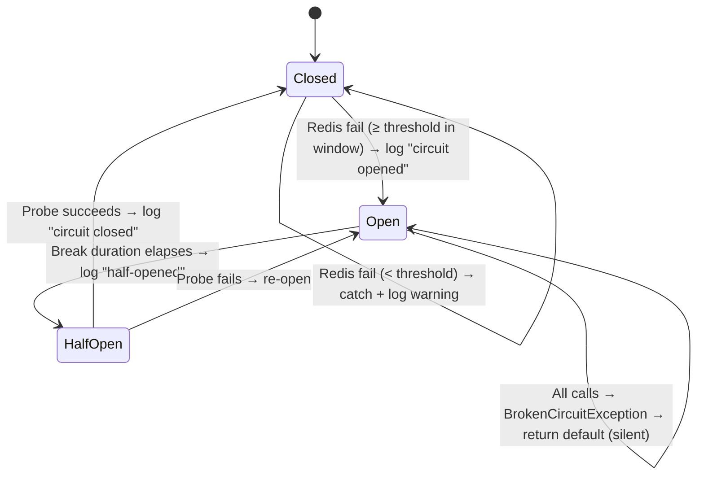

# Cache Circuit Breaker

**Date**: 2026-02-23
**Scope**: Add Polly v8 circuit breaker to CacheService to short-circuit during sustained Redis outages

## Summary

Added a circuit breaker around all `IDistributedCache` operations in `CacheService` using Polly v8 via `Microsoft.Extensions.Resilience`. When Redis is down, the circuit opens after configurable failure thresholds and all cache operations return defaults immediately — no connection attempt, no latency, no per-operation log spam. The circuit self-heals via half-open probes once the break duration elapses.

## Changes Made

| File | Change | Reason |
|------|--------|--------|
| `Directory.Packages.props` | Added `Microsoft.Extensions.Resilience` 10.3.0 | Polly v8 circuit breaker package |
| `MyProject.Infrastructure.csproj` | Replaced `Microsoft.Extensions.Http.Polly` with `Microsoft.Extensions.Resilience` | Polly v7 reference was unused and caused type ambiguity with v8; kept in `Directory.Packages.props` for #194 |
| `Caching/Options/CachingOptions.cs` | Added `CircuitBreakerOptions` nested class with `FailureThreshold`, `BreakDuration`, `SamplingDuration` | Configurable circuit breaker behavior with validation |
| `Caching/Extensions/ServiceCollectionExtensions.cs` | Registered named resilience pipeline `"cache"` with circuit breaker strategy and logging callbacks | DI-integrated pipeline with state transition logging (opened/half-opened/closed) |
| `Caching/Services/CacheService.cs` | Injected `ResiliencePipelineProvider<string>`, wrapped operations in pipeline, catch `BrokenCircuitException` silently | Core behavior change — short-circuit on sustained failure |
| `appsettings.json` | Added `CircuitBreaker` section under `Caching` | Discoverability; defaults work without config |
| `MyProject.Component.Tests.csproj` | Added `Microsoft.Extensions.Resilience` package | Tests need pipeline provider types |
| `CacheServiceTests.cs` | Updated constructor with no-op pipeline, added 5 circuit breaker tests | Verify open-circuit behavior, no-log guarantee, and recovery via FakeTimeProvider |

## Decisions & Reasoning

### Polly v8 via Microsoft.Extensions.Resilience (not raw Polly)

- **Choice**: Use `AddResiliencePipeline` from `Microsoft.Extensions.Resilience`
- **Alternatives considered**: Raw Polly v8, custom circuit breaker implementation
- **Reasoning**: Microsoft-recommended pattern for .NET 10, integrates with DI and `TimeProvider`, sets precedent for HTTP resilience (#194)

### FailureRatio = 1.0 with MinimumThroughput

- **Choice**: Circuit opens when all requests in the sampling window fail
- **Alternatives considered**: Partial failure ratio (e.g., 0.5)
- **Reasoning**: Cache is optional infrastructure — we only want to short-circuit during total outage, not intermittent hiccups. `MinimumThroughput` controls the "N consecutive failures" intent from issue #249

### Remove Http.Polly from Infrastructure.csproj

- **Choice**: Removed `Microsoft.Extensions.Http.Polly` PackageReference from Infrastructure (kept in `Directory.Packages.props`)
- **Alternatives considered**: Extern alias, fully-qualified type disambiguation
- **Reasoning**: The v7 Polly package was unused in Infrastructure and caused CS0433 ambiguity with `BrokenCircuitException` existing in both assemblies. Kept in central package versions for future HTTP resilience work (#194)

## Diagrams

## Follow-Up Items

- [ ] #194 — HTTP resilience using the same `Microsoft.Extensions.Resilience` pattern
- [ ] Remove `Microsoft.Extensions.Http.Polly` from `Directory.Packages.props` once #194 is complete
