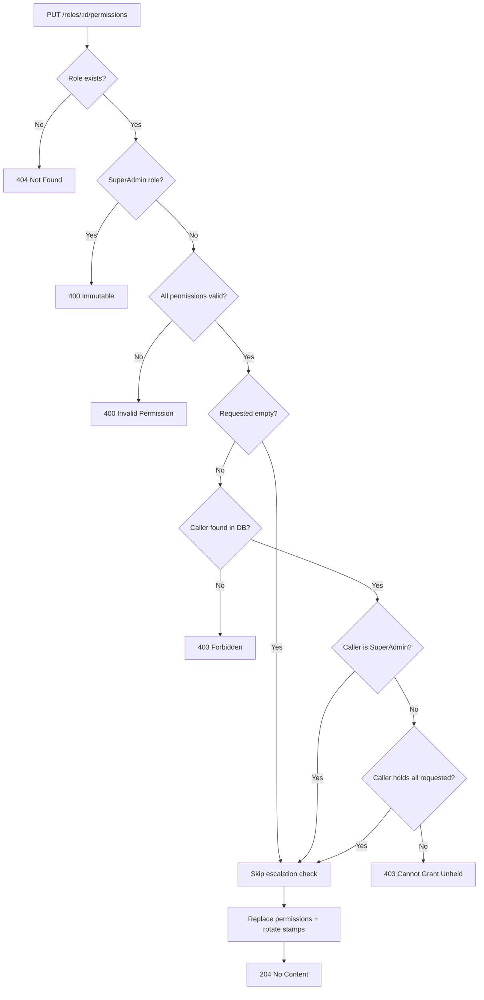

# Fix: Role Permission Editing Privilege Escalation

**Date**: 2026-02-23
**Scope**: Prevent privilege escalation via `SetRolePermissions` endpoint

## Summary

`PUT /api/v1/admin/roles/{id}/permissions` allowed any user with `roles.manage` to grant arbitrary permissions to any non-SuperAdmin role, including permissions they don't hold. This enabled privilege escalation: an admin could add permissions to a custom role, assign that role to themselves, and gain elevated access. The fix adds a service-layer "can't grant what you don't have" check, a new `ErrorType.Forbidden` (403) variant, and comprehensive test coverage across all branches.

## Changes Made

| File | Change | Reason |
|------|--------|--------|
| `src/backend/MyProject.Shared/ErrorMessages.cs` | Added `Roles.CannotGrantUnheldPermission` | Static error message for escalation denial |
| `src/backend/MyProject.Shared/ErrorType.cs` | Added `Forbidden = 3` | Authorization denials should return 403, not 400 |
| `src/backend/MyProject.WebApi/Shared/ProblemFactory.cs` | Added `Forbidden => 403` mapping | Wire new ErrorType to HTTP status code |
| `src/backend/MyProject.Application/Features/Admin/IRoleManagementService.cs` | Added `callerUserId` param to `SetRolePermissionsAsync` | Service needs caller identity for escalation check |
| `src/backend/MyProject.Infrastructure/Features/Admin/Services/RoleManagementService.cs` | Added `EnforcePermissionEscalationAsync` private method | Core fix: resolves caller permissions from DB, rejects if granting unheld permissions |
| `src/backend/MyProject.WebApi/Features/Admin/AdminController.cs` | Passes `userContext.AuthenticatedUserId` to service | Follows existing pattern from all other admin mutations |
| `src/backend/tests/MyProject.Unit.Tests/Shared/ErrorTypeTests.cs` | Updated enum count, added Forbidden value test | Prevent silent enum additions |
| `src/backend/tests/MyProject.Api.Tests/Controllers/AdminControllerTests.cs` | Added 6 new tests (callerUserId verification, 403, 404, SuperAdmin, etc.) | Full HTTP-level coverage of all SetPermissions paths |
| `src/backend/tests/MyProject.Component.Tests/Services/RoleManagementServiceTests.cs` | Added 5 new tests + 2 helpers, tightened existing | Every branch of `EnforcePermissionEscalationAsync` covered |

## Decisions & Reasoning

### Service-layer check (not controller or middleware)

- **Choice**: Escalation guard lives in `RoleManagementService.EnforcePermissionEscalationAsync`
- **Alternatives considered**: Controller-level check (JWT claims), authorization policy/handler
- **Reasoning**: Consistent with `EnforceHierarchyAsync` pattern used by all other admin mutations. DB is authoritative (JWT could be stale). Endpoint is rate-limited so extra queries are acceptable.

### ErrorType.Forbidden (403) instead of Validation (400)

- **Choice**: Added `ErrorType.Forbidden = 3` to the enum
- **Alternatives considered**: Reuse `Validation` (400) as originally implemented
- **Reasoning**: The caller is authenticated and authorized for `roles.manage`, but denied a specific operation because they lack the permissions being granted. This is an authorization denial, not a validation error. Using 400 would confuse API consumers and weaken security semantics.

### Caller-not-found returns 403 (fail closed)

- **Choice**: Return `ErrorMessages.Auth.InsufficientPermissions` with `ErrorType.Forbidden`
- **Alternatives considered**: Return 404 with `UserNotFound`, return 500 as internal error
- **Reasoning**: Fail closed. If the authenticated caller can't be found in the DB, something is wrong (deleted between auth and this call). Returning 404 leaks internal state; 500 is honest but exposes infrastructure details. 403 with a generic message denies without information leakage.

### Permission removal is unrestricted

- **Choice**: The escalation guard only checks grants, not removals
- **Alternatives considered**: Also check that caller holds every permission being removed
- **Reasoning**: "Can't grant what you don't have" prevents privilege escalation. Allowing removal of unheld permissions is safe (reduces, not escalates). Restricting removal would make it impossible for an admin to clean up a role with permissions they don't hold.

## Diagrams

## Follow-Up Items

- [ ] #271 — Indirect privilege escalation via `AssignRoleAsync`: admin can assign users to custom roles carrying permissions they don't hold
