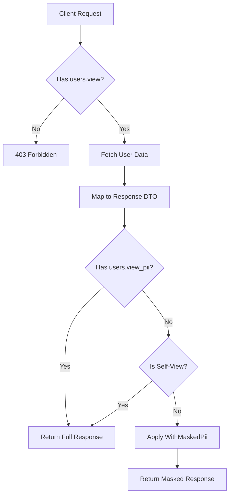

# PII Compliance — Permission-Gated Masking

**Date**: 2026-02-23
**Scope**: Admin user endpoints now mask PII (email, username, phone) unless the caller has the `users.view_pii` permission

## Summary

Added a `users.view_pii` permission that controls visibility of personally identifiable information in admin user endpoints (`/api/admin/users`, `/api/admin/users/{id}`). Without the permission, email is masked to `j***@g***.com` format, username follows the same pattern, and phone numbers become `***`. SuperAdmin sees everything implicitly. Users always see their own data unmasked (self-view exemption). Frontend displays visual indicators (EyeOff icons, tooltips, i18n labels) when PII is masked.

## Changes Made

| File | Change | Reason |
|------|--------|--------|
| `Application/.../AppPermissions.cs` | Added `Users.ViewPii = "users.view_pii"` | New permission constant; auto-discovered by reflection |
| `Application/.../IUserContext.cs` | Added `bool HasPermission(string permission)` | Controller needs to check permissions without `[RequirePermission]` attribute |
| `Infrastructure/.../UserContext.cs` | Implemented `HasPermission` with SuperAdmin bypass | Mirrors `PermissionAuthorizationHandler` logic |
| `WebApi/.../PiiMasker.cs` | New static class: `MaskEmail`, `MaskPhone` | Reusable masking utilities |
| `WebApi/.../AdminMapper.cs` | Added `WithMaskedPii` extension methods for single user and list | Applies masking while preserving non-PII fields and self-view exemption |
| `WebApi/.../AdminController.cs` | Applied masking in `ListUsers` and `GetUser` | Permission check at controller level, after mapping |
| `frontend/.../permissions.ts` | Added `ViewPii`, `isSuperAdmin`, updated `hasPermission` with SuperAdmin bypass | Frontend permission mirror with implicit SuperAdmin grant |
| `frontend/.../UserTable.svelte` | Added `piiMasked` prop, EyeOff tooltip on email header, italic emails | Visual indicator when PII is masked in user list |
| `frontend/.../AccountInfoCard.svelte` | Added `piiMasked` prop, EyeOff + "Masked" labels for username/email/phone | Replaces raw masked values with clear "Masked" indicators |
| `frontend/.../UserDetailCards.svelte` | Computed `piiMasked`, passed to `AccountInfoCard` | Connects permission check to child component |
| `frontend/.../users/+page.svelte` | Computed `piiMasked`, passed to `UserTable` | Connects permission check to user list |
| `frontend/.../users/[id]/+page.svelte` | Added "Email hidden" indicator with EyeOff in header | User detail header shows masking state |
| `frontend/.../messages/en.json` | Added 3 i18n keys: `admin_pii_masked`, `admin_pii_maskedTooltip`, `admin_pii_emailMasked` | English translations for masking UI |
| `frontend/.../messages/cs.json` | Added corresponding Czech translations | Czech translations for masking UI |
| `Api.Tests/.../PiiMaskerTests.cs` | 11 unit tests for email/phone masking edge cases | Coverage for empty, whitespace, no-at, no-dot, multi-dot domains |
| `Api.Tests/.../AdminMapperPiiTests.cs` | 5 tests for masking extensions and self-view exemption | Verifies PII masked, non-PII preserved, caller exempt in lists |
| `Api.Tests/.../AdminControllerTests.cs` | 5 integration tests for masking + refactored helpers to `TryAddWithoutValidation` | Full authorization matrix: view-only, self-view, SuperAdmin |
| `Api.Tests/.../TestAuthHandler.cs` | Added `WithUserAndPermissions` helper | Supports testing with specific user ID and permissions |
| `FILEMAP.md` | Added `PiiMasker.cs` impact row | Change traceability |

## Decisions & Reasoning

### Permission-gated, not config-gated

- **Choice**: Dedicated `users.view_pii` permission
- **Alternatives considered**: Feature flag (`DemoOptions.Enabled` pattern from netrock-demo)
- **Reasoning**: A permission is more flexible — operators can grant it per-role without redeployment. Follows the "deny first, open selectively" principle.

### Masking at controller level

- **Choice**: Apply masking in `AdminController` after mapping to response DTOs
- **Alternatives considered**: Query-level masking (SELECT only non-PII columns), Application layer masking
- **Reasoning**: Keeps Application/Infrastructure layers unaware of masking. The controller owns the response shape and already has access to `IUserContext`. Full data in memory is acceptable for an admin panel.

### Self-view exemption

- **Choice**: Users always see their own data unmasked, even in admin views
- **Alternatives considered**: No exemption (mask everything for users without `ViewPii`)
- **Reasoning**: Avoids confusion when an admin views their own profile. The user already has access to their own PII through the regular profile page.

### Frontend defense in depth

- **Choice**: Backend masks the actual wire data; frontend adds visual indicators on top
- **Alternatives considered**: Frontend-only masking (check permission, hide fields)
- **Reasoning**: Backend masking ensures PII never reaches the client. Frontend indicators provide clear UX explaining why data appears masked.

## Diagrams

## Follow-Up Items

- [ ] Consider whether `firstName`/`lastName` should be masked (currently unmasked by design — needed for admin identification)
- [ ] Consider whether `bio` free-text field should be masked (users may include PII in bio)
- [ ] Add EyeOff icon to mobile card view for consistency with desktop table (currently italic-only on mobile)
