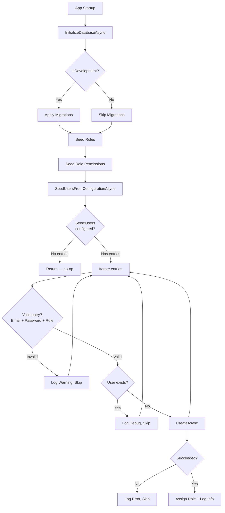
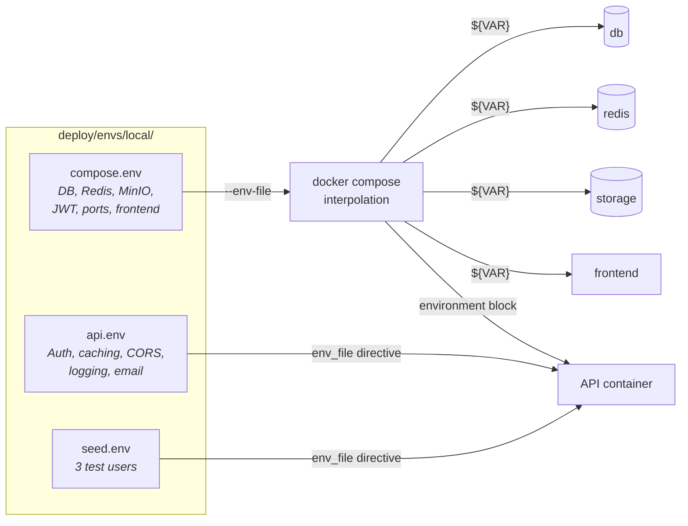

# Seed Users from Environment Variables

**Date**: 2026-02-23
**Scope**: Replace hardcoded dev seed users with configuration-driven seeding from env vars; restructure env files into concern-scoped folders

## Summary

Replaced the hardcoded `SeedUsers.cs` constants and `IsDevelopment()` gate with a unified configuration-driven mechanism that reads `Seed:Users` from `IConfiguration` (populated by env vars like `Seed__Users__0__Email`). This enables production bootstrap admins on first deploy while keeping local dev seeding identical. As part of this work, restructured the flat env files (`local.env`, `production.env.example`) into folder-based layouts with separate files per concern (`compose.env`, `api.env`, `seed.env`).

## Changes Made

| Commit | Description |
|--------|-------------|
| `feat(seed): replace hardcoded dev users with configuration-driven seeding` | New `SeedOptions` + `SeedUserEntry` classes, rewrote `ApplicationBuilderExtensions` to read `Seed:Users` config section, deleted `SeedUsers.cs` |
| `refactor(deploy): restructure env files into concern-scoped folders` | Split flat env files into `deploy/envs/{env}/{compose,api,seed}.env`, updated `up.sh`/`up.ps1`, compose overlays, `.gitignore` |
| `docs: update env file references for folder-based structure` | Updated AGENTS.md, FILEMAP.md, SKILLS.md, README.md, before-you-ship.md, development.md |
| `fix(seed): check CreateAsync result and reduce log noise` | Check `IdentityResult` from `CreateAsync`, log error on failure, differentiate created vs already-exists log levels |

| File | Change | Reason |
|------|--------|--------|
| `Infrastructure/Persistence/Options/SeedOptions.cs` | Created | Options class for `Seed:Users` array binding |
| `Infrastructure/Persistence/Extensions/ApplicationBuilderExtensions.cs` | Rewrote seeding logic | Config-driven seeding with validation and logging |
| `Infrastructure/Features/Authentication/Constants/SeedUsers.cs` | Deleted | Replaced by env var mechanism |
| `deploy/envs/local/compose.env` | Created | Docker Compose interpolation vars (DB, Redis, MinIO, JWT, ports, frontend) |
| `deploy/envs/local/api.env` | Created | ASP.NET config overrides (auth, caching, CORS, logging, email) |
| `deploy/envs/local/seed.env` | Created | Local dev seed user definitions |
| `deploy/envs/production-example/compose.env` | Created | Production template for compose vars |
| `deploy/envs/production-example/api.env` | Created (from old `production.env.example`) | Production template for API config |
| `deploy/envs/production-example/seed.env` | Created | Production template with commented bootstrap admin |
| `deploy/envs/local.env` | Deleted | Replaced by folder structure |
| `deploy/envs/production.env.example` | Deleted | Replaced by folder structure |
| `deploy/up.sh` | Updated | Resolve `envs/{name}/compose.env` directory instead of flat file |
| `deploy/up.ps1` | Updated | Same as above for PowerShell |
| `deploy/docker-compose.local.yml` | Updated | Multiple `env_file` entries (api.env + seed.env) |
| `deploy/docker-compose.production.yml` | Updated | Multiple `env_file` entries, updated setup comment |
| `.gitignore` | Updated | Ignore `deploy/envs/production/` directory |
| `AGENTS.md` | Updated | Env file path references |
| `FILEMAP.md` | Updated | Change impact tables for new env paths |
| `SKILLS.md` | Updated | Recipes reference new env paths |
| `README.md` | Updated | Seed user table references `seed.env`, fixed credentials |
| `docs/before-you-ship.md` | Updated | Added bootstrap admin checklist item, updated setup command |
| `docs/development.md` | Updated | Env file path references |

## Decisions & Reasoning

### Single mechanism for all environments (no IsDevelopment gate)

- **Choice**: `Seed:Users` config array read from env vars, runs in all environments
- **Alternatives considered**: Keep `IsDevelopment()` gate with separate production seeding; use `IHostedService` with DI-registered options
- **Reasoning**: Env vars themselves gate whether seeding happens — if no `Seed__Users__*` vars are set, nothing is seeded. This is simpler and more declarative than environment checks. No DI registration or `ValidateOnStart` needed since seeding is optional.

### Inline validation over data annotations

- **Choice**: Validate each entry inline (non-empty email/password, valid role) with warning logs for skipped entries
- **Alternatives considered**: `[Required]` attributes with `ValidateDataAnnotations()`, custom `IValidateOptions<T>`
- **Reasoning**: Seeding is optional and best-effort — a missing entry shouldn't crash the app. Warning logs give clear feedback without preventing startup.

### Folder-based env file structure

- **Choice**: `deploy/envs/{env}/{compose,api,seed}.env` with three files per environment
- **Alternatives considered**: Keep flat files with seed vars appended; single file per environment with sections; more granular files (email.env, captcha.env, etc.)
- **Reasoning**: Three files hit the sweet spot — `compose.env` for Docker Compose interpolation (shared across services), `api.env` for ASP.NET config (API container only), `seed.env` for user seeding (clear separation, easy to remove after bootstrap). More granular would create too many small files; fewer would lose the declarative benefit.

### production-example directory (not .example suffix)

- **Choice**: `deploy/envs/production-example/` directory committed, `deploy/envs/production/` gitignored
- **Alternatives considered**: `.example` suffix on each file inside a `production/` directory; single example file with all vars
- **Reasoning**: `cp -r production-example production` is a single command. The directory structure mirrors local exactly, so operators know what files to expect. Gitignoring the entire `production/` directory is cleaner than individual file patterns.

## Diagrams

## Follow-Up Items

- [ ] Update init scripts (`init.sh`, `init.ps1`) to write `{INIT_*}` placeholders into new file paths — currently works via global find-and-replace, but comments referencing file paths in the scripts may need updating
- [ ] Consider `required: false` on `seed.env` in production compose overlay (Docker Compose v2.24+) so operators don't need to create seed.env if they don't want bootstrap seeding
