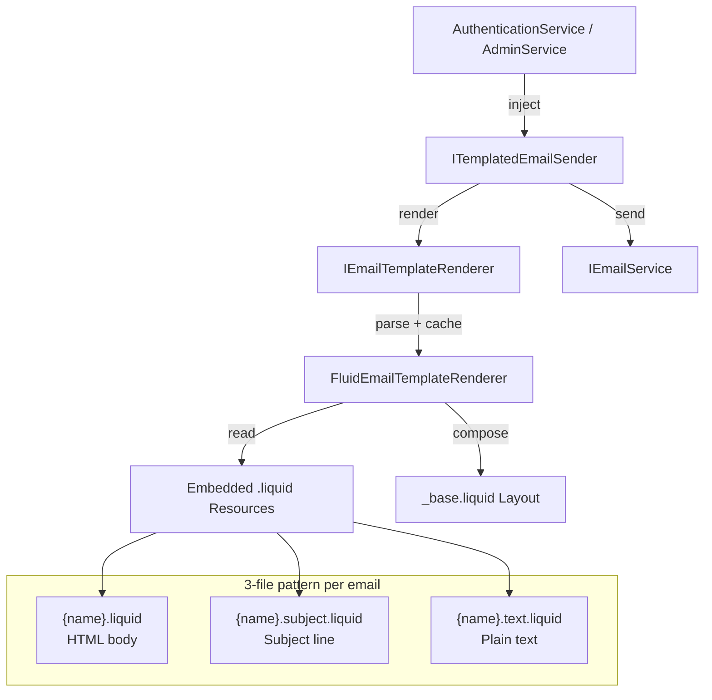

# Fluid Email Template System

**Date**: 2026-02-24
**Scope**: Replace inline C# email composition with Fluid (Liquid) templates

## Summary

Replaced 4 transactional emails (verify-email, reset-password, admin-reset-password, invitation) that used inline C# string interpolation with Fluid (Liquid) templates rendered from embedded `.liquid` resources. This produces professional, responsive HTML emails with a shared layout, plain text alternatives, and proper XSS protection via HTML encoding. The implementation went through 3 strict review passes, addressing thread safety, cancellation semantics, PII in logs, and null-forgiving operator violations.

## Changes Made

| File | Change | Reason |
|------|--------|--------|
| `Directory.Packages.props` | Added Fluid.Core 2.13.0 | Liquid template engine |
| `MyProject.Infrastructure.csproj` | Added PackageReference + EmbeddedResource glob | Fluid dependency + template embedding |
| `IEmailTemplateRenderer.cs` | New interface + RenderedEmail record | Application-layer rendering contract |
| `ITemplatedEmailSender.cs` | New interface for safe render+send | DRY extraction of duplicate private methods |
| `EmailTemplateModels.cs` | 4 new model records | One per email template |
| `FluidEmailTemplateRenderer.cs` | New renderer implementation | Cached, thread-safe Fluid rendering with `const` resource prefix |
| `TemplatedEmailSender.cs` | New render+send wrapper | Exception-swallowing send with `OperationCanceledException` re-throw |
| `_base.liquid` | Shared HTML email layout | 600px centered card, header, footer, Outlook compatibility |
| `*.liquid` (12 files) | HTML body, subject, plain text per email | 3-file pattern for each of 4 templates |
| `AuthenticationService.cs` | Replaced inline HTML with `ITemplatedEmailSender` | Cleaner service, template-driven emails |
| `AdminService.cs` | Same replacement + dynamic token lifetime | Consistent with AuthenticationService |
| `ServiceCollectionExtensions.cs` | Registered renderer + sender in DI, updated XML doc | Singleton renderer, scoped sender |
| `FluidEmailTemplateRendererTests.cs` | New 23-test suite | Rendering, encoding, layout, concurrency, error handling, special char app_name |
| `TemplatedEmailSenderTests.cs` | New 4-test suite | Render+send, exception swallowing, cancellation propagation |
| `AuthenticationServiceTests.cs` | Updated to mock `ITemplatedEmailSender` | Matches new service dependencies |
| `AdminServiceTests.cs` | Updated to mock `ITemplatedEmailSender` | Matches new service dependencies |
| `FILEMAP.md` | Added email template impact table + file tree | Change tracking |
| `SKILLS.md` | Added "Add a Transactional Email Template" recipe + subject safety note | Repeatable process with security guidance |
| `AGENTS.md` | Added Email Templates section | Architecture documentation |

## Decisions & Reasoning

### Fluid.Core over Razor/Scriban

- **Choice**: Fluid (Liquid) template engine
- **Alternatives considered**: Razor views, Scriban, raw string interpolation
- **Reasoning**: Fluid is sandboxed (no arbitrary code execution), lightweight (no MVC dependency), and Liquid syntax is widely known. Scriban would also work but Fluid's model registration is more explicit and security-focused.

### Embedded resources over file system

- **Choice**: Templates as embedded resources via `Assembly.GetManifestResourceStream()`
- **Alternatives considered**: `EmbeddedFileProvider`, file system templates
- **Reasoning**: No extra NuGet dependency, templates are immutable at runtime, deployed inside the assembly. No risk of missing files in production.

### ConcurrentDictionary + Lazy for cache

- **Choice**: `ConcurrentDictionary<string, Lazy<IFluidTemplate>>` with new `FluidParser` per parse
- **Alternatives considered**: Simple `ConcurrentDictionary<string, IFluidTemplate>`, lock-based cache
- **Reasoning**: `Lazy<T>` guarantees single-execution per key even under concurrent access. New `FluidParser` per parse avoids thread-safety issues since `FluidParser` is not documented as thread-safe.

### ITemplatedEmailSender extraction

- **Choice**: Separate `ITemplatedEmailSender` interface wrapping render+send+catch
- **Alternatives considered**: Keep private methods in each service, extension method
- **Reasoning**: Both services had identical 10-line private methods. Extracting to a service is testable independently, follows single responsibility, and prevents the pattern from being duplicated in future services.

### Encoder at render time (not on TemplateOptions)

- **Choice**: Pass `HtmlEncoder.Default` to `template.Render(context, encoder)` for HTML, no encoder for plain text/subject
- **Alternatives considered**: Separate `TemplateOptions` per encoding type
- **Reasoning**: Fluid's API passes the encoder at render time, not as an option. One shared `TemplateOptions` (with snake_case naming) works for all templates.

### Const resource prefix over Namespace reflection

- **Choice**: `private const string ResourcePrefix = "MyProject.Infrastructure.Features.Email.Templates"`
- **Alternatives considered**: `typeof(...).Namespace!.Replace(".Services", ".Templates")`
- **Reasoning**: Eliminates `null!` violation (hard CLAUDE.md rule), avoids reflection at static init, and is clearer. Trade-off is manual update on namespace rename, but embedded resource names already require that.

### OperationCanceledException re-throw in TemplatedEmailSender

- **Choice**: `catch (OperationCanceledException) { throw; }` before the general catch
- **Alternatives considered**: Catching all exceptions uniformly
- **Reasoning**: Cooperative cancellation is a .NET runtime contract. Swallowing it causes cancelled HTTP requests to continue executing through remaining service code (audit logging, DB saves), wasting server resources under load.

## Diagrams

## Review History

| Pass | Findings | Result |
|------|----------|--------|
| Review 1 | 3 blockers (thread safety, `null!`, race condition) | Fixed |
| Review 2 | Confirmed all 3 fixes correct, 0 new issues | Passed |
| Review 3 (non-blocking) | 3 warnings (special char test, DRY, concurrency test) | Fixed via `ITemplatedEmailSender` extraction |
| Review 4 | 2 blockers (`OperationCanceledException`, `Namespace!`), 5 warnings (PII, cancellation test, thread-safety doc, XML doc, subject safety) | Fixed |
| Review 5 (verification) | All 7 findings verified fixed, 0 new issues | **SHIP IT** |

## Follow-Up Items

- [ ] Consider subfolder organization for templates if count grows beyond 6-8 emails
- [ ] SMTP/API email provider implementation (currently NoOp in development)
