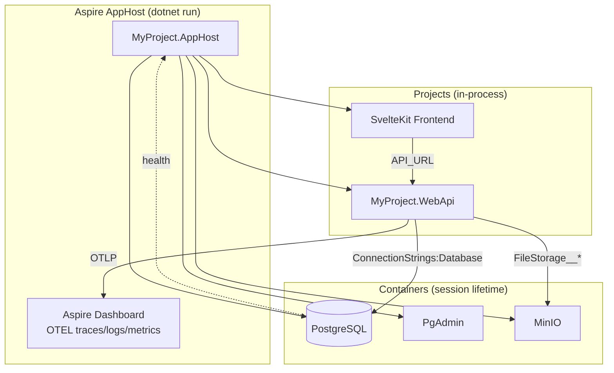

# Aspire + OpenTelemetry Migration

**Date**: 2026-02-28
**Scope**: Migrate local development from Docker Compose to .NET Aspire, replace Serilog.Sinks.Seq with OpenTelemetry

## Summary

Added Aspire ServiceDefaults project with full OpenTelemetry instrumentation (metrics, tracing, logging) and an AppHost orchestrator that replaces Docker Compose for local development. The migration eliminates `docker-compose.local.yml`, all `deploy/envs/local/` files, and Seq — replacing them with a single `dotnet run` command that provides PostgreSQL, MinIO, API, and frontend with an integrated OTEL dashboard.

## Changes Made

### PR 1: ServiceDefaults + OTEL (`feat/service-defaults`)

| File | Change | Reason |
|------|--------|--------|
| `MyProject.ServiceDefaults/Extensions.cs` | New shared Aspire project | OTEL metrics/tracing/logging, service discovery, HTTP resilience |
| `MyProject.ServiceDefaults/MyProject.ServiceDefaults.csproj` | New project file | `IsAspireSharedProject=true` with OTEL + resilience packages |
| `Directory.Packages.props` | Add OTEL + resilience + ServiceDiscovery packages, remove Seq | OTEL instrumentation and Aspire integration |
| `MyProject.Infrastructure.csproj` | Remove `Serilog.Sinks.Seq` | Logging now handled by ServiceDefaults OTEL provider |
| `LoggerConfigurationExtensions.cs` | Remove Seq/OTEL sink, keep Console only | OTEL log export handled by ServiceDefaults via `writeToProviders: true` |
| `MyProject.WebApi.csproj` | Add ServiceDefaults project reference | Wire OTEL into the API |
| `Program.cs` | Add `builder.AddServiceDefaults()` | Activate OTEL, service discovery, resilience |
| `MyProject.slnx` | Add ServiceDefaults project | Solution awareness |
| `appsettings.Development.json` | Remove Serilog Seq config | Seq package removed |

### PR 2: AppHost + Migration (`feat/aspire-local-dev`)

| File | Change | Reason |
|------|--------|--------|
| `MyProject.AppHost/Program.cs` | New Aspire orchestrator | PostgreSQL, MinIO, API, Frontend with pinned ports |
| `MyProject.AppHost/*.csproj, appsettings, launchSettings` | New project files | AppHost configuration |
| `docker-compose.local.yml` | Deleted | Replaced by Aspire |
| `deploy/envs/local/*` | Deleted (3 files) | Config moved to appsettings.Development.json |
| `appsettings.Development.json` | Major rework | Remove stale Seq/ConnectionStrings/FileStorage, add Seed users |
| `appsettings.json` | Add FileStorage placeholder | Base config for production |
| `init.sh`, `init.ps1` | Docker → Aspire | Simplified ports (2 vs 7), launch Aspire after setup |
| `deploy/up.sh`, `deploy/up.ps1` | Update docs | Clarify production-only usage |
| `vite.config.ts` | `PORT` env var support | Aspire controls frontend port |
| 13 documentation files | Seq → OTEL, Docker Compose → Aspire | Comprehensive doc migration |

## Decisions & Reasoning

### Seq removal — OTEL via ServiceDefaults only

- **Choice**: Remove `Serilog.Sinks.Seq` entirely, do NOT add `Serilog.Sinks.OpenTelemetry`
- **Alternatives considered**: Replace Seq with Serilog OTEL sink, keep Seq alongside OTEL
- **Reasoning**: ServiceDefaults registers `builder.Logging.AddOpenTelemetry()` as an ILogger provider. With `UseSerilog(writeToProviders: true)`, Serilog forwards all logs to ILogger providers including the OTEL one. Adding a separate Serilog OTEL sink would cause every log to hit the OTLP collector twice. Console is the only Serilog-specific sink needed.

### Session lifetime (not Persistent) for containers

- **Choice**: Use default session lifetime — containers stop on Ctrl+C
- **Alternatives considered**: `ContainerLifetime.Persistent` to keep containers running
- **Reasoning**: Persistent containers don't free system resources and cause PostgreSQL password mismatch on recreation (Aspire generates random passwords). Session lifetime + named data volumes gives the best UX: data persists, resources are freed.

### Explicit PostgreSQL password

- **Choice**: `builder.AddParameter("postgres-password", secret: true)` with dev password in appsettings.json
- **Alternatives considered**: User Secrets, auto-generated passwords
- **Reasoning**: Without explicit passwords, Aspire generates random ones each run. Existing volumes have the old password baked in during `initdb`, causing auth failures on container recreation. Explicit dev password ensures credential stability.

### Two stacked PRs

- **Choice**: Split into ServiceDefaults+OTEL (PR 1) and AppHost+migration (PR 2)
- **Alternatives considered**: Single PR, three PRs (OTEL, AppHost, docs)
- **Reasoning**: PR 1 is a clean, reviewable unit (new project + package swap). PR 2 builds on it with the full migration. Two PRs keep review scope manageable while maintaining logical cohesion.

## Diagrams

## Review Fixes Applied

After creating the PRs, a detailed review identified 4 critical and 4 minor issues. All were fixed in commit `64e4cb9`.

### Critical

| Issue | Fix |
|-------|-----|
| **Duplicate OTEL logs**: ServiceDefaults + Serilog OTEL sink both exported to collector | Removed `Serilog.Sinks.OpenTelemetry` entirely; ServiceDefaults handles log export via `writeToProviders: true` |
| **SQL text in traces**: `SetDbStatementForText = true` captured full SQL (WHERE clauses with PII) | Removed the option (defaults to false) |
| **CAPTCHA failure on fresh setup**: `.env.example` had `<TURNSTILE_SITE_KEY>` placeholder | Set to Cloudflare's always-pass test key `1x00000000000000000000AA` |
| **JWT secret regression**: Init scripts no longer generated random keys | Restored JWT generation in `init.sh`/`init.ps1`, added `{INIT_JWT_SECRET}` placeholder to `appsettings.json` |

### Minor

| Issue | Fix |
|-------|-----|
| Unused `Microsoft.Extensions.Resilience` package | Removed from `Directory.Packages.props` |
| Stale `local` examples in `deploy/up.sh` | Updated to `production` examples with Aspire note |
| Stale csproj comment referencing docker-compose.local | Updated to generic publish comment |
| EF Core `Fatal` log level too aggressive | Changed to `Warning` in `appsettings.Development.json` |

### Test fix

The `{INIT_JWT_SECRET}` placeholder (17 chars) broke 138 API tests — too short for HMAC SHA-256. Fixed by adding a JWT key override in `appsettings.Testing.json`.

## Follow-Up Items

- [ ] Merge PR 1 (`feat/service-defaults`) first, then PR 2 (`feat/aspire-local-dev`)
- [ ] Run init script end-to-end on a clean clone to validate the full bootstrap experience
- [ ] Consider adding Redis back as an optional L2 cache backend via Aspire (if needed later)
