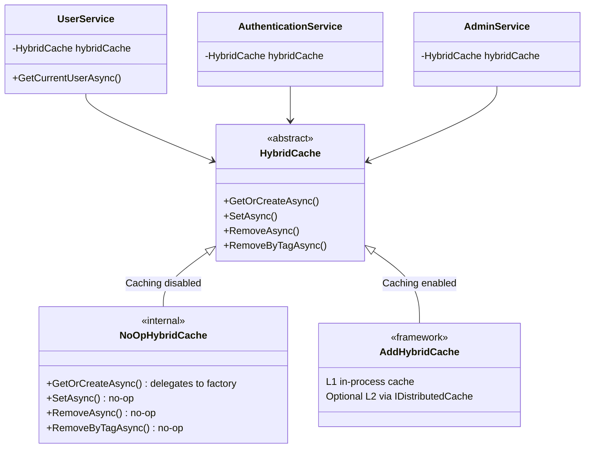

# HybridCache Migration & Redis Removal

**Date**: 2026-02-28
**Scope**: Replace custom ICacheService + Redis + Polly circuit breaker with .NET's built-in HybridCache, remove Redis from the entire stack

## Summary

Replaced the custom `ICacheService` abstraction (backed by `IDistributedCache` with Redis and a Polly circuit breaker) with .NET's built-in `HybridCache`. This eliminates ~1,650 lines of custom caching infrastructure and removes Redis as a runtime dependency. Redis was removed due to licensing concerns (SSPL/RSALv2 since March 2024). Users who need distributed caching can register any `IDistributedCache` provider — HybridCache picks it up automatically as an L2 backend.

## Changes Made

| File | Change | Reason |
|------|--------|--------|
| `Application/Caching/ICacheService.cs` | Deleted | Custom abstraction replaced by `HybridCache` |
| `Infrastructure/Caching/Services/CacheService.cs` | Deleted | Redis + Polly implementation removed |
| `Infrastructure/Caching/Services/NoOpCacheService.cs` | Deleted | Replaced by `NoOpHybridCache` |
| `Infrastructure/Caching/Services/NoOpHybridCache.cs` | Created | Subclass of `HybridCache` for disabled-caching mode |
| `Infrastructure/Caching/Options/CachingOptions.cs` | Simplified | Removed `RedisOptions`, `InMemoryOptions`, `CircuitBreakerOptions` — only `Enabled` + `DefaultExpiration` remain |
| `Infrastructure/Caching/Extensions/ServiceCollectionExtensions.cs` | Rewritten | `AddHybridCache()` replaces distributed cache + Polly pipeline |
| `Infrastructure/Identity/Services/UserService.cs` | Refactored | Get+Set collapsed into `GetOrCreateAsync<UserOutput?>` with stampede protection |
| `Infrastructure/Features/*/Services/*.cs` | Updated | `ICacheService` → `HybridCache` in AuthenticationService, AdminService, RoleManagementService |
| `Infrastructure/Persistence/Interceptors/UserCacheInvalidationInterceptor.cs` | Updated | `.AsTask()` for `ValueTask` → `Task.WhenAll` compatibility |
| `Infrastructure/Features/Authentication/Extensions/ServiceCollectionExtensions.cs` | Updated | JWT validator: `GetOrSetAsync` → `GetOrCreateAsync`, XML comment updated |
| `WebApi/Extensions/HealthCheckExtensions.cs` | Updated | Redis health check removed |
| `Directory.Packages.props` | Updated | Removed Redis, Polly, HealthChecks.Redis packages; added `Microsoft.Extensions.Caching.Hybrid`; removed orphaned `Microsoft.Extensions.Http.Polly` |
| `*.csproj` (3 files) | Updated | Package references aligned |
| `appsettings.json` | Updated | Redis/InMemory/CircuitBreaker config sections removed |
| `appsettings.Development.json` | Updated | Redis/InMemory config blocks removed |
| `appsettings.Testing.json` | Updated | Stale Redis section removed |
| `deploy/docker-compose.yml` | Updated | Redis service, volume, and env vars removed |
| `deploy/docker-compose.local.yml` | Updated | Redis port mapping removed |
| `deploy/docker-compose.production.yml` | Updated | Redis hardening block removed |
| `deploy/envs/*/compose.env` | Updated | Redis password and port references removed |
| `deploy/envs/*/api.env` | Updated | Caching section rewritten for HybridCache |
| `init.sh`, `init.ps1` | Updated | Redis port allocation, display, and placeholder replacement removed |
| `CLAUDE.md`, `README.md`, `AGENTS.md`, `FILEMAP.md`, `SKILLS.md` | Updated | Redis → HybridCache across all documentation |
| `docs/*.md` (5 files) | Updated | Architecture, features, security, troubleshooting, before-you-ship |
| Test files (8 files) | Updated | Mock swaps, deleted old cache tests, created `NoOpHybridCacheTests` |

## Decisions & Reasoning

### HybridCache over custom ICacheService

- **Choice**: Use .NET's built-in `HybridCache` abstract class directly as the service abstraction
- **Alternatives considered**: Keeping a thin wrapper interface, using `IDistributedCache` directly
- **Reasoning**: `HybridCache` IS the abstraction — it's an abstract class, mockable with NSubstitute, provides L1 in-process caching with stampede protection, and automatically picks up any registered `IDistributedCache` as L2. No custom code needed.

### Redis removal due to licensing

- **Choice**: Remove Redis entirely from the stack
- **Alternatives considered**: Keeping Redis as optional, switching to Valkey/KeyDB/Dragonfly
- **Reasoning**: Redis moved from BSD to dual SSPL/RSALv2 in March 2024. Since this is an MIT-licensed template, bundling Redis creates licensing friction for users. HybridCache's L1 in-process cache covers single-instance deployments. Users who need distributed caching can register their own `IDistributedCache` provider (Redis, Valkey, SQL Server, etc.) — HybridCache picks it up automatically.

### NoOpHybridCache not sealed

- **Choice**: `internal class NoOpHybridCache` (not `sealed`)
- **Alternatives considered**: `sealed class`
- **Reasoning**: `Substitute.ForPartsOf<NoOpHybridCache>()` is used in `UserServiceTests` to create a partial mock that calls the real factory pass-through while tracking calls. NSubstitute requires the class to be non-sealed for `ForPartsOf`.

### GetOrCreateAsync with nullable UserOutput

- **Choice**: `GetOrCreateAsync<UserOutput?>` with null return from factory when user not found
- **Alternatives considered**: Separate Get+Set pattern, throwing on not-found
- **Reasoning**: Collapses the old two-step Get-then-Set into a single atomic call with built-in stampede protection. Null results are cached briefly (via L1 TTL), preventing repeated DB hits for non-existent users during the cache window.

## Diagrams

## Follow-Up Items

- [ ] `init.sh` / `init.ps1` still allocate port offsets +0, +2, +4, +8, +10, +12 (gap at +6 where Redis was) — cosmetic, doesn't affect functionality
- [ ] Historical session docs in `docs/sessions/` still reference Redis — these are factual records and should not be rewritten
- [ ] GitHub issue [#335](https://github.com/fpindej/netrock/issues/335) tracks this work
