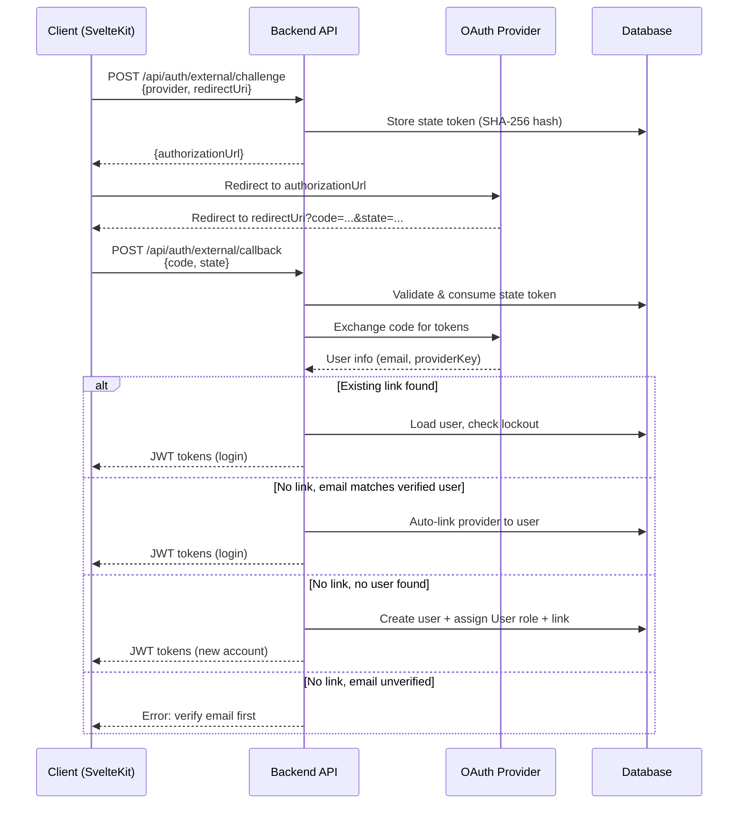
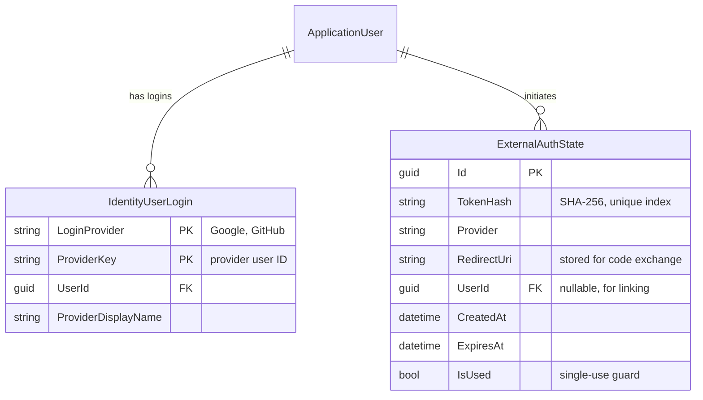

# OAuth External Login Providers (Google, GitHub)

**Date**: 2026-03-02
**Scope**: Full-stack implementation of OAuth2 external login via Google and GitHub, spanning 5 stacked PRs (#358, #359, #360, #361, #369)

## Summary

Added support for external OAuth2/OIDC login via Google and GitHub. The feature is fully config-driven: when no provider credentials are configured, the UI is unchanged. When credentials are present, OAuth buttons appear on the login page and a "Connected Accounts" card appears in settings. The backend handles code exchange via `HttpClient` (no ASP.NET OAuth middleware), supports auto-linking by verified email, and guards against privilege escalation and orphaned accounts.

## Changes Made

### PR #358 - Backend infrastructure (options, providers, state entity)

| File | Change | Reason |
|------|--------|--------|
| `Infrastructure/.../Options/ExternalAuthOptions.cs` | Options class with `ProviderOptions` nested class, `IValidatableObject` | Config-driven provider management with startup validation |
| `Infrastructure/.../ExternalProviders/IExternalAuthProvider.cs` | Provider abstraction interface | Decouple auth flow from specific providers |
| `Infrastructure/.../ExternalProviders/ExternalUserInfo.cs` | DTO for provider user data | Normalize user info across providers |
| `Infrastructure/.../ExternalProviders/GoogleAuthProvider.cs` | Google OIDC implementation (id_token + userinfo) | Token exchange and user info extraction |
| `Infrastructure/.../ExternalProviders/GitHubAuthProvider.cs` | GitHub OAuth2 implementation (token + /user + /user/emails) | Handle GitHub's multi-endpoint flow and private emails |
| `Infrastructure/.../Models/ExternalAuthState.cs` | State token entity (SHA-256 hashed, single-use, expiring) | CSRF protection for OAuth flow |
| `Infrastructure/.../Configurations/ExternalAuthStateConfiguration.cs` | EF Core config with indexes | Unique index on token hash, index on expiry |
| `Infrastructure/.../Extensions/ServiceCollectionExtensions.cs` | DI registration for options, HttpClients, providers | Only register enabled providers |
| `Shared/ErrorMessages.cs` | ExternalAuth error message constants | Consistent error reporting |
| `Application/.../AuditActions.cs` | Audit action constants for OAuth events | Audit trail for external auth operations |
| `WebApi/appsettings*.json` | ExternalProviders config sections | All disabled by default |

### PR #359 - Backend service, endpoints, user model

| File | Change | Reason |
|------|--------|--------|
| `Application/.../IExternalAuthService.cs` | Service interface with challenge, callback, unlink, providers | Clean architecture boundary |
| `Application/.../Dtos/External*.cs` | Input/output DTOs (challenge, callback, provider info) | Type-safe service contracts |
| `Infrastructure/.../Services/ExternalAuthService.cs` | Core linking logic (512 lines) | Account creation, auto-link, unlink guard |
| `WebApi/.../AuthController.cs` | 4 new endpoints (providers, challenge, callback, unlink) | Public API surface |
| `WebApi/.../Dtos/External/*.cs` | Request/response DTOs with validators | Input validation at API boundary |
| `Application/.../Dtos/UserOutput.cs` | Added `LinkedProviders` and `HasPassword` | Frontend needs to know auth state |
| `WebApi/.../Dtos/UserResponse.cs` + mapper | Map new user fields | Expose to frontend |
| `Application/.../Dtos/SetPasswordInput.cs` | Set-password DTO for passwordless users | OAuth-only users need password escape hatch |
| `Infrastructure/.../AuthenticationService.cs` | `SetPasswordAsync` implementation | Guard: only when no password exists |

### PR #360 - Frontend OAuth login flow

| File | Change | Reason |
|------|--------|--------|
| `routes/(public)/oauth/callback/+page.server.ts` | Server-side callback handler | Exchange code via backend, handle errors |
| `routes/(public)/oauth/callback/+page.svelte` | Callback UI with error mapping | Spinner during processing, i18n error display |
| `components/oauth/OAuthProviderButton.svelte` | Single provider button | Outline variant with provider icon |
| `components/oauth/OAuthProviderButtons.svelte` | Provider list with divider | Fetches available providers, renders conditionally |
| `components/oauth/ProviderIcon.svelte` | Shared Google/GitHub SVG icons | DRY - used in both login and settings |
| `lib/utils/oauth.ts` | Shared `startOAuthChallenge` utility | DRY - challenge logic used in login and settings |
| `components/auth/LoginForm.svelte` | Added `OAuthProviderButtons` | OAuth buttons below submit, before signup link |
| `messages/en.json` + `cs.json` | OAuth i18n keys with error mappings | Full Czech and English translations |
| `lib/api/v1.d.ts` | Manual type additions for OAuth endpoints | Cache description annotation |

### PR #361 - Frontend settings integration

| File | Change | Reason |
|------|--------|--------|
| `components/settings/SetPasswordForm.svelte` | Password form for OAuth-only users | Shown instead of ChangePasswordForm when no password |
| `components/oauth/ConnectedAccountsCard.svelte` | Link/unlink providers card | Shows connected status, guards last auth method |
| `components/oauth/DisconnectDialog.svelte` | Confirmation dialog for unlinking | Follows TwoFactorDisableDialog pattern |
| `routes/(app)/settings/+page.svelte` | Integrated new cards | Conditional SetPassword vs ChangePassword, ConnectedAccounts card |

### PR #369 - Tests

| File | Change | Reason |
|------|--------|--------|
| `tests/Api.Tests/.../AuthController.ExternalTests.cs` | API integration tests | Endpoint behavior, error responses, rate limiting |
| `tests/Api.Tests/.../Validators/External*.cs` | Validator tests | Challenge and callback request validation |
| `tests/Component.Tests/.../ExternalAuthServiceTests.cs` | Service unit tests | Linking logic, state validation, unlink guard, lockout, cache |
| `frontend/.../ConnectedAccountsCard.test.ts` | Component tests | Render states, connect/disconnect flows |
| `frontend/.../OAuthProviderButtons.test.ts` | Component tests | Empty state, button rendering, challenge flow |
| `frontend/.../page.server.test.ts` | Callback route tests | Code exchange, error handling, cookie forwarding |
| `frontend/.../proxy.test.ts` | Proxy update test | Cookie auth path includes callback |

## Decisions & Reasoning

### Manual OAuth via HttpClient (no ASP.NET middleware)

- **Choice**: Build OAuth code exchange with raw `HttpClient` calls per provider
- **Alternatives considered**: ASP.NET `AddGoogle()`/`AddGitHub()` authentication middleware
- **Reasoning**: The backend must be client-agnostic (SvelteKit, React, mobile apps). ASP.NET OAuth middleware assumes server-side redirect handling, which doesn't work when the frontend mediates the callback. Manual exchange gives full control over the flow and works with any client type.

### Client-provided redirectUri with server whitelist

- **Choice**: Client sends its own `redirectUri`, validated against `AllowedRedirectUris` whitelist
- **Alternatives considered**: Backend owns the redirect URI
- **Reasoning**: Supports multiple client types (web: `https://`, mobile: `myapp://`) without backend changes. The whitelist prevents open-redirect attacks. The URI is stored in the state token and reused during code exchange per OAuth2 spec (exact match required).

### Auto-link by verified email

- **Choice**: When an unauthenticated user signs in via OAuth and a local account with the same verified email exists, auto-link the provider
- **Alternatives considered**: Always require manual linking from settings while logged in
- **Reasoning**: Industry standard UX (Google, GitHub, Auth0 all do this). Guarded by requiring both provider `email_verified` claim and local `EmailConfirmed` flag. Unverified emails are rejected with a clear message.

### Skip 2FA for OAuth login

- **Choice**: OAuth login bypasses 2FA challenge
- **Alternatives considered**: Require 2FA after OAuth callback
- **Reasoning**: Industry standard. The provider already verified user identity. Google and GitHub both support their own 2FA/passkey flows. Double-prompting degrades UX without meaningful security gain.

### Error string mapping (frontend i18n bridge)

- **Choice**: Frontend maps exact backend English `ProblemDetails.detail` strings to i18n keys via `ERROR_MAP`
- **Alternatives considered**: Backend returns error codes, backend returns i18n keys
- **Reasoning**: Pragmatic bridge - avoids backend changes to existing `ErrorMessages.cs` pattern. Marked with a TODO to replace with proper error codes. Falls back to generic message for unmapped errors.

## Diagrams

## Follow-Up Items

- [x] #368 - Replace static appsettings configuration with admin-managed DB storage
- [ ] #381 - Add HTTP client resilience (retries, circuit breakers) for OAuth providers
- [ ] Replace frontend `ERROR_MAP` string matching with backend error codes
- [ ] Add Apple Sign-In provider (same `IExternalAuthProvider` pattern)
