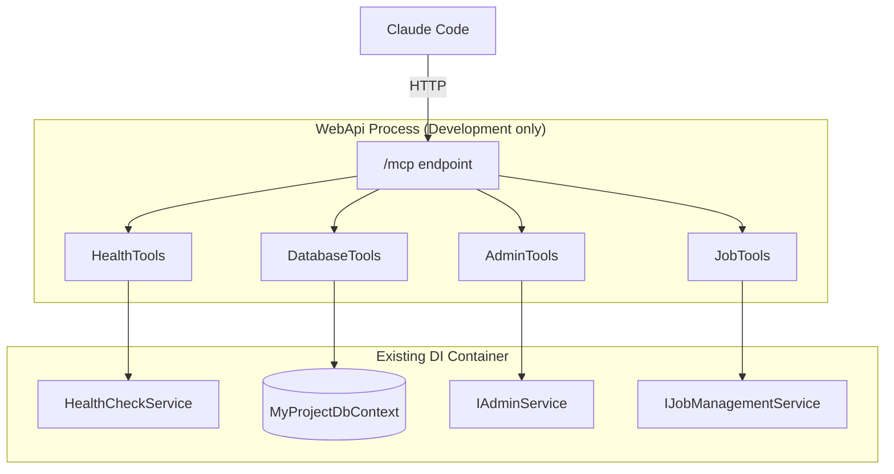

# MCP Server for Claude Code Integration

**Date**: 2026-03-14
**Scope**: Embed a dev-only MCP (Model Context Protocol) server in WebApi

## Summary

Added an MCP endpoint at `/mcp` in the WebApi project, gated by `IsDevelopment()`. When the API runs locally via Aspire, Claude Code connects automatically (via `.mcp.json`) and gains 6 tools for interacting with the running application - health checks, database queries, schema introspection, user listing, and job management. All tools reuse existing DI services with zero duplication.

## Changes Made

| File | Change | Reason |
|------|--------|--------|
| `Directory.Packages.props` | Added `ModelContextProtocol.AspNetCore` v1.1.0 | NuGet package for MCP server support |
| `MyProject.WebApi.csproj` | Added package reference | WebApi needs the MCP library |
| `MyProject.Infrastructure.csproj` | Added `InternalsVisibleTo` for WebApi | MCP database tools need access to `internal` `MyProjectDbContext` |
| `WebApi/Mcp/HealthTools.cs` | New - `get-health` tool | Structured health status from `HealthCheckService` |
| `WebApi/Mcp/DatabaseTools.cs` | New - `query-database` and `get-schema` tools | Read-only SQL (SELECT only, 100-row limit) and EF Core model introspection |
| `WebApi/Mcp/AdminTools.cs` | New - `list-users` tool | Paginated user list via `IAdminService` |
| `WebApi/Mcp/JobTools.cs` | New - `list-jobs` and `trigger-job` tools | Recurring job management via `IJobManagementService` |
| `WebApi/Program.cs` | Two isolated `IsDevelopment()` blocks | Service registration and endpoint mapping for MCP |
| `.mcp.json` | New - Claude Code MCP config | Auto-connects Claude Code to the MCP endpoint; `{INIT_API_PORT}` replaced by init scripts |
| `FILEMAP.md` | Added MCP entries | Change impact tracking |
| `docs/development.md` | Added MCP Server section | Developer documentation |
| `.claude/agents/backend-engineer.md` | Added MCP Tools section | Agent awareness of MCP tool pattern |
| `.claude/agents/fullstack-engineer.md` | Added MCP Tools section | Agent awareness of MCP tool pattern |

## Decisions & Reasoning

### Dev-only gating

- **Choice**: Gate MCP with `IsDevelopment()`, no auth on the endpoint
- **Alternatives considered**: Always-on with JWT auth; configurable via appsettings
- **Reasoning**: The tools bypass the permission system (raw SQL, unscoped user list) - they're developer conveniences, not a production API surface. Production MCP would be a separate feature with its own auth story.

### Static tool classes with DI injection

- **Choice**: Static methods with `[McpServerTool]` attribute, DI parameters injected by the framework
- **Alternatives considered**: Instance-based tool classes, manual tool registration
- **Reasoning**: `WithToolsFromAssembly()` auto-discovers static tools - no registration boilerplate. DI parameters are resolved per-call from the existing container. Matches the simplest pattern from the ModelContextProtocol library.

### SELECT-only validation in query-database

- **Choice**: Keyword blocklist (INSERT, UPDATE, DELETE, DROP, ALTER, CREATE, TRUNCATE, EXEC, EXECUTE, GRANT, REVOKE) plus SELECT prefix check
- **Alternatives considered**: Read-only transaction, database role with SELECT-only permissions
- **Reasoning**: Simple and effective for dev-time safety. A read-only DB role would be more robust but adds infrastructure complexity for a dev-only tool.

### InternalsVisibleTo for WebApi

- **Choice**: Grant WebApi access to Infrastructure internals
- **Alternatives considered**: Make `MyProjectDbContext` public; create a public wrapper service
- **Reasoning**: `InternalsVisibleTo` is the narrowest change - keeps `MyProjectDbContext` internal for all other consumers. The MCP tools are the only WebApi code that needs direct DbContext access.

## Diagrams

## Follow-Up Items

- [ ] Production MCP server - separate feature with JWT auth, permission-scoped tools, rate limiting, audit logging
- [ ] Generator extraction - add `@feature mcp` markers when syncing to netrock-cli templates
