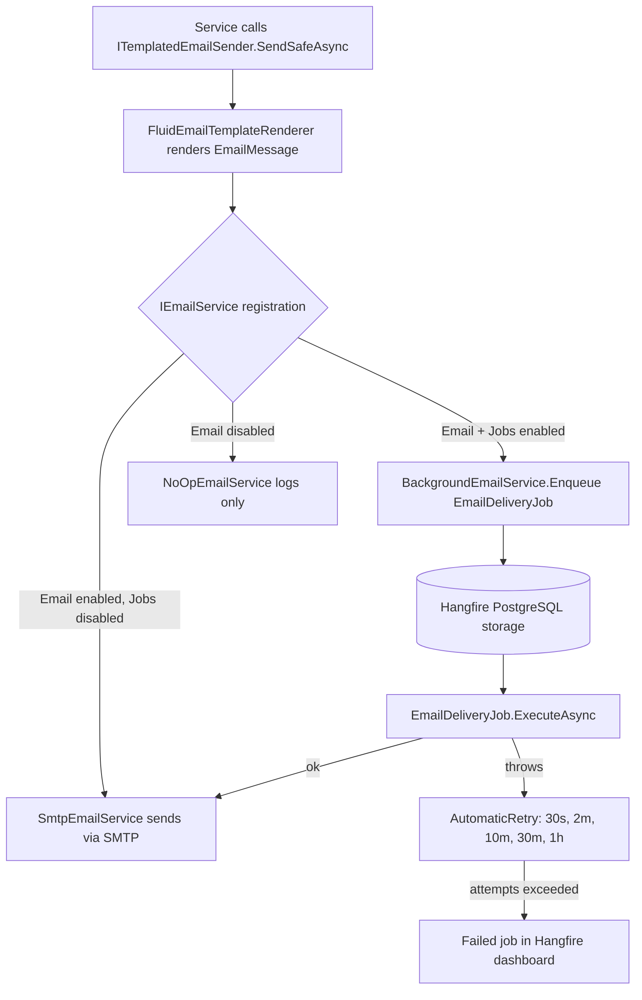

# Resilient Email Delivery via Hangfire Background Jobs

**Date**: 2026-08-17
**Scope**: Route transactional emails through Hangfire so SMTP failures are retried instead of silently swallowed (issue #348).

## Summary

`TemplatedEmailSender.SendSafeAsync` swallowed SMTP exceptions, so verification, password-reset, invitation and 2FA emails could be lost without any recovery. Emails are now queued as Hangfire jobs (`EmailDeliveryJob`) whenever both `Email:Enabled` and `JobScheduling:Enabled` are `true`; the job runs `SmtpEmailService` under `[AutomaticRetry]` with 5 attempts and 30s/2m/10m/30m/1h backoff, and exhausted retries stay visible as failed jobs in the Hangfire dashboard. Email-only configurations still send directly, disabled email keeps the no-op path. Verified end-to-end on a freshly initialized project under Aspire: forgot-password produced a succeeded `EmailDeliveryJob.ExecuteAsync` job and the message landed in MailPit.

## Changes Made

| File | Change | Reason |
|------|--------|--------|
| `src/backend/MyProject.Infrastructure/Features/Email/Jobs/EmailDeliveryJob.cs` | New Hangfire job executing `SmtpEmailService.SendEmailAsync` with `[AutomaticRetry]` | Retry/backoff/dead-letter via Hangfire, no custom outbox |
| `src/backend/MyProject.Infrastructure/Features/Email/Services/BackgroundEmailService.cs` | New `IEmailService` that enqueues `EmailDeliveryJob` with the rendered `EmailMessage` | Decouple request path from SMTP availability |
| `src/backend/MyProject.Infrastructure/Features/Email/Extensions/ServiceCollectionExtensions.cs` | Reads `JobScheduling:Enabled`; registers background, direct SMTP or no-op sender | Routing decision in one place |
| `src/backend/MyProject.Infrastructure/Features/Email/Services/TemplatedEmailSender.cs` | XML doc updated | Describe enqueue vs direct hand-off |
| `src/backend/tests/MyProject.Component.Tests/Services/BackgroundEmailServiceTests.cs` | Enqueue, cancellation and Hangfire serialization round-trip tests | Guard job args stay serializable |
| `src/backend/tests/MyProject.Component.Tests/Services/EmailDeliveryJobTests.cs` | Retry attribute shape and exception propagation tests | Ensure Hangfire can retry |
| `src/backend/tests/MyProject.Component.Tests/Extensions/EmailServiceRegistrationTests.cs` | DI routing tests (background / direct / no-op) | Cover the configuration matrix |
| `FILEMAP.md`, `docs/features.md`, `docs/before-you-ship.md`, `docs/architecture.md`, `README.md`, `.claude/skills/add-background-job/SKILL.md` | Document the new delivery path and one-time job conventions | Keep docs and skills accurate |

## Decisions & Reasoning

### Dedicated `EmailDeliveryJob` instead of enqueuing `SmtpEmailService` directly

- **Choice**: A thin `internal sealed EmailDeliveryJob(SmtpEmailService)` carrying the `[AutomaticRetry]` attribute.
- **Alternatives considered**: `Enqueue<SmtpEmailService>(s => s.SendEmailAsync(...))` with the attribute on `SmtpEmailService`.
- **Reasoning**: Keeps `SmtpEmailService` a pure sender usable on the direct path, gives the dashboard a meaningful job name, and keeps Hangfire concerns in one class.

### Job argument is the rendered `EmailMessage`

- **Choice**: Render synchronously in `TemplatedEmailSender`, enqueue the resulting `EmailMessage` (To, Subject, HtmlBody, PlainTextBody).
- **Alternatives considered**: Enqueue template name + model and render inside the job.
- **Reasoning**: Template/model errors surface immediately in the calling request log, job payloads are a simple record that Hangfire's Newtonsoft serializer round-trips (covered by a test), and no generic model registry is needed.

### Retry policy as constants, not options

- **Choice**: `Attempts = 5`, `DelaysInSeconds = [30, 120, 600, 1800, 3600]`, `OnAttemptsExceeded = Fail`.
- **Alternatives considered**: Configurable retry options.
- **Reasoning**: Attribute arguments must be compile-time constants; a sensible default avoids an options class nobody tunes. Failed jobs can be retried from the dashboard.

### No extra logging inside the job

- **Choice**: Let exceptions propagate; Hangfire's `AutomaticRetry` already logs each failed attempt with the exception.
- **Reasoning**: Avoids duplicate log lines and keeps PII exposure identical to the existing `SmtpEmailService` log (recipient + subject).

## Diagrams

## Follow-Up Items

- [ ] Consider a dedicated Hangfire queue for email if other one-time jobs start competing for workers.
