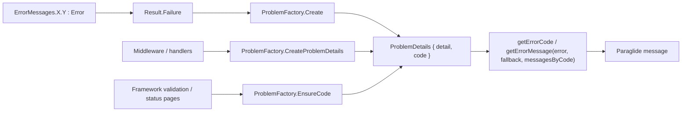

# ProblemDetails Error Codes

**Date**: 2026-08-17
**Scope**: Machine-readable `code` on every ProblemDetails response (backend), code-based error translation in the frontend (issue #452)

## Summary

Every client-facing error is now an `Error` record (stable snake_case `Code` + human `Message`) declared once in `ErrorMessages.cs`. `Result`/`Result<T>` carry the `Error`, and every `ProblemDetails` body written by the API (controllers, authorization handler, exception middleware, origin validation, rate limiter, model validation, status code pages) exposes the code in a `code` extension next to the unchanged `detail`. The frontend regenerated `v1.d.ts`, gained `getErrorCode()` and a code-keyed `ErrorMessagesByCode` option on `getErrorMessage()`, and the OAuth callback page and `LoginForm` translate by code instead of matching English strings - removing the codebase's last TODO.

## Changes Made

| File | Change | Reason |
|------|--------|--------|
| `src/backend/MyProject.Shared/Error.cs` | New `Error(Code, Message)` record | Single value carrying both the machine-readable code and the human message |
| `src/backend/MyProject.Shared/ErrorMessages.cs` | Every `const string` became `static readonly Error` with a `{class}_{field}` snake_case code; new `FileStorage` group, `Auth.RegistrationInvalid`, `Auth.PasswordPolicyViolation`, `Server.TooManyRequests` | Codes are a public contract and must be centralized; the new entries replace ad-hoc literal messages |
| `src/backend/MyProject.Shared/Result.cs` | `Error` property and `Failure(...)` overloads take `Error` | Result carries the code through to the controller |
| `src/backend/MyProject.WebApi/Shared/ProblemFactory.cs` | `Create(Error?, ErrorType?)`, `CreateProblemDetails(Error, status)`, `EnsureCode(ProblemDetails)` | One place that writes `detail` + `code`; fallback codes for framework-generated bodies |
| `src/backend/MyProject.WebApi/Program.cs` | `ProblemFactory.EnsureCode` in `CustomizeProblemDetails` | Model validation (`validation_failed`) and status code pages (`not_found`, ...) also carry a code |
| `src/backend/MyProject.WebApi/Middlewares/*`, `Authorization/ProblemDetailsAuthorizationHandler.cs`, `Extensions/RateLimiterExtensions.cs` | Build bodies via `ProblemFactory.CreateProblemDetails` | 401/403/429/500/404 paths carry codes |
| `src/backend/MyProject.WebApi/Features/OpenApi/Transformers/ProblemDetailsSchemaTransformer.cs` | New schema transformer | Documents `code` on the `ProblemDetails` schema so generated clients see it |
| `src/backend/MyProject.Infrastructure/...` | Services use `ErrorMessages` entries (S3 storage), `with { Message = ... }` for Identity password/registration feedback | No literal strings in `Result.Failure`, stable code kept for dynamic messages |
| `src/backend/tests/...` | `ProblemDetailsAssert`, `ProblemFactoryTests`, `ProblemDetailsCodeTests`, `ErrorMessagesTests` code-convention tests, existing tests use `ErrorMessages` entries | Verify code presence across the whole pipeline and enforce the naming convention |
| `src/frontend/src/lib/api/v1.d.ts` | Regenerated from the API OpenAPI document (dumped via the API test host) | `ProblemDetails.code` typed |
| `src/frontend/src/lib/api/error-handling.ts` | `ProblemDetails` interface with `code`, `getErrorCode()`, `ErrorMessagesByCode`, `getErrorMessage(error, fallback, messagesByCode?)` | Helpers prefer `code` when a translation exists |
| `src/frontend/src/lib/components/auth/LoginForm.svelte` | Translate by `auth_login_*` codes | Removes `detail.includes('temporarily locked')` string matching |
| `src/frontend/src/routes/(public)/oauth/callback/+page.server.ts`, `+page.svelte` | Load returns the backend `code`; page maps codes to messages | Removes the English-string `ERROR_MAP` and the TODO |
| `src/frontend/src/messages/{en,cs}/oauth.json` | `oauth_callback_invalidState`, `oauth_callback_providerError` | Cover the remaining callback failure codes |
| `FILEMAP.md`, `.claude/rules/*.md`, `.claude/skills/backend-conventions/SKILL.md`, `.claude/skills/frontend-conventions/SKILL.md`, agents/review references, `docs/features.md` | Document the convention | Single source of truth for the error code contract |

## Decisions & Reasoning

### `Error` record instead of a parallel code constant

- **Choice**: `Error(Code, Message)` record; `ErrorMessages` entries become `static readonly Error`; `Result.Error` is `Error?`
- **Alternatives considered**: keep `const string` messages and add a separate `ErrorCodes` class; add an optional `string? Code` parameter to `Result.Failure`
- **Reasoning**: a single value cannot drift (every message has exactly one code), call sites stay `Result.Failure(ErrorMessages.X.Y)`, and `record with { Message = ... }` keeps a stable code for the few dynamic messages (password policy, retry hint)

### Codes derived from the declaring location

- **Choice**: `{nested_class}_{field_name}` snake_case, enforced by `ErrorMessagesTests` (pattern + global uniqueness)
- **Alternatives considered**: hand-picked short codes
- **Reasoning**: greppable, collision-free, no bikeshedding; the test makes renames a conscious (breaking) act

### `code` as a ProblemDetails extension, fallback for framework bodies

- **Choice**: `Extensions["code"]`; `EnsureCode` in `AddProblemDetails` gives `validation_failed` to `HttpValidationProblemDetails` and the snake_case reason phrase to anything else without a code
- **Alternatives considered**: custom `ProblemDetails` subclass; leaving framework-generated bodies without a code
- **Reasoning**: extension keeps RFC 9457 shape and the existing `ProblemDetails` OpenAPI schema (documented via a schema transformer); every error response having a code is what makes clients able to rely on it

### Frontend maps keyed by code, not `m[code]`

- **Choice**: `ErrorMessagesByCode` maps (`code -> Paraglide message function`) passed to `getErrorMessage`, or looked up directly on the OAuth callback page
- **Alternatives considered**: use backend codes verbatim as i18n keys and index the Paraglide module dynamically
- **Reasoning**: keeps the `{domain}_{feature}_{element}` i18n key convention, stays type-safe and tree-shakeable, and unknown codes still fall back to `detail`/`title`/fallback

## Diagrams

## Follow-Up Items

- [ ] Migrate the remaining `getErrorMessage(apiError, fallback)` call sites to code-keyed translations where a localized message adds value (issue #452 step 4, "gradually migrate")
