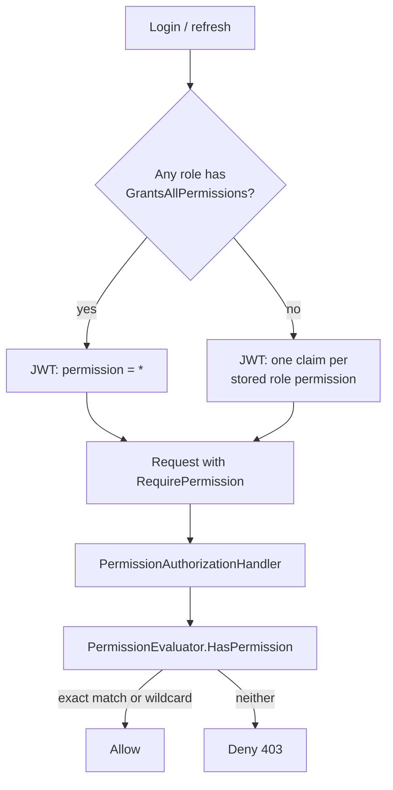

# Data-Driven Role Model

**Date**: 2026-08-22
**Scope**: Authorization-model refactor: replace the Superuser name-based bypass with database-backed role metadata and a wildcard permission claim.

## Summary

Replaced every role-name special case in authorization with data-driven role metadata. Roles now carry `IsSystem`, `Rank`, and `GrantsAllPermissions` columns seeded from declarative `AppRoles.Definitions`; grants-all roles receive a single wildcard `permission: *` JWT claim evaluated by a new `PermissionEvaluator`, which is the single decision point for all permission checks. Escalation guards were consolidated into `PermissionEscalationGuard` and now run on every role assignment, and the last-superuser lockout protection was generalized to "the system may never end with zero grants-all holders" and made race-safe under Postgres.

## Changes Made

| File | Change | Reason |
|------|--------|--------|
| `MyProject.Application/Identity/Constants/RoleDefinition.cs` | New declarative role definition record | Single authoring point for built-in role metadata and default permissions |
| `MyProject.Application/Identity/Constants/AppRoles.cs` | Replaced `GetRoleRank`/`GetHighestRank` with `Definitions` | Rank and flags move to the database; code no longer hardcodes hierarchy |
| `MyProject.Application/Identity/Constants/AppPermissions.cs` | Added `Wildcard = "*"` on the outer class | Nested-type discovery keeps the wildcard out of the persisted permission catalog |
| `MyProject.Application/Identity/PermissionEvaluator.cs` | New single decision point (`HasPermission`, `HoldsAll`) | One place evaluates exact-match plus wildcard; documents the multitenancy seam |
| `MyProject.Infrastructure/.../Models/ApplicationRole.cs` + `ApplicationRoleConfiguration.cs` | New `IsSystem`, `Rank`, `GrantsAllPermissions` columns | Database becomes the runtime source of truth for role behavior |
| `MyProject.Infrastructure/.../ApplicationBuilderExtensions.cs` | Declarative role seeding: upsert metadata, additive permissions, definition validation, stamp rotation on grants-all transition, fail startup on seed errors | Idempotent convergence; pre-refactor superuser tokens are revoked; misconfigured seeds cannot boot into an admin lockout |
| `MyProject.WebApi/.../PermissionAuthorizationHandler.cs`, `MyProject.Infrastructure/Identity/UserContext.cs` | Delegate to `PermissionEvaluator` | Removes the `IsInRole(Superuser)` bypass; fail-closed for anonymous/missing claims |
| `MyProject.Infrastructure/.../JwtTokenProvider.cs` | Emit a single `*` claim for grants-all roles | Constant token size, never stale when permissions are added |
| `MyProject.Infrastructure/.../PermissionEscalationGuard.cs` | New shared guard | One query resolves held permissions; callers can only grant what they hold |
| `MyProject.Infrastructure/.../AdminService.cs` | Rank checks read role metadata; escalation runs on every assignment; lockout invariant re-verified inside a serializable transaction; post-delete side effects reordered | Closes escalation and TOCTOU gaps found in security review |
| `MyProject.Infrastructure/.../RoleManagementService.cs` | `IsSystem`/`GrantsAllPermissions` flags drive rename/delete/permission rules | No name-based business rules remain |
| `MyProject.Infrastructure/Identity/Services/UserService.cs` | Self-deletion uses the same transactional lockout invariant; post-delete stamp-cache eviction | Same invariant everywhere; no updates against deleted rows |
| `MyProject.WebApi/.../AdminRoleResponse.cs`, `RoleDetailResponse.cs`, mappers, DTOs | Expose `rank` and `grantsAllPermissions` | Frontend derives hierarchy from the API instead of mirrored constants |
| `src/frontend/src/lib/utils/roles.ts`, `permissions.ts` | Rank map built from admin roles API; removed mirrored `SystemRoles` | Server is authoritative; no client-side rank table to drift |
| Tests (backend + frontend) | New `PermissionEvaluatorTests`, `TestRoles` fixture, escalation/lockout/definition-invariant coverage; updated contracts | Pin the new authorization semantics |

## Decisions & Reasoning

### Wildcard claim instead of per-permission claims for grants-all roles

- **Choice**: Grants-all roles get a single `permission: *` JWT claim, synthesized at token generation and never stored as a role claim.
- **Alternatives considered**: Embedding the full permission catalog in the token; keeping the role-name bypass.
- **Reasoning**: Constant token size and never stale when new permissions ship. The wildcard cannot be injected: `AppPermissions.All` is discovered from nested types only (the wildcard lives on the outer class), the `SetPermissions` validator regex rejects `*`, and the service re-validates against the catalog. API consumers still see the expanded catalog, never the wildcard.

### Database as the runtime source of truth, seeded declaratively

- **Choice**: `AppRoles.Definitions` is upserted at startup; services read `Rank`/`IsSystem`/`GrantsAllPermissions` from the database.
- **Alternatives considered**: Keeping ranks in code; config-file role definitions.
- **Reasoning**: Custom roles and built-ins follow one model, and the multitenancy seam stays open (tenant-scoped roles add a column, not new code paths). Seeding is convergent: metadata drift is corrected, permission seeding is additive-only so operator grants survive, and any seed failure aborts startup because booting with wrong metadata could strip every superuser of the wildcard.

### Escalation guard on every assignment, wildcard required for grants-all targets

- **Choice**: `PermissionEscalationGuard.EnsureCallerHoldsAllAsync` runs for all role assignments and permission grants; assigning a grants-all role requires the caller to hold the wildcard.
- **Alternatives considered**: Checking only custom (rank 0) roles as before.
- **Reasoning**: Operators can expand any role's permission set at runtime, so system roles are not exempt. A grants-all role stores no claims, so its required set is the wildcard itself; roles granting nothing pass unconditionally.

### Lockout invariant: transactional re-verification under serializable isolation

- **Choice**: Role removal, admin deletion, and self-deletion mutate and re-verify "at least one grants-all holder remains" inside one serializable transaction via the execution strategy; grants-all definitions must carry the maximum rank (validated at seed time and by unit test).
- **Alternatives considered**: Pre-check only (racy); advisory locks.
- **Reasoning**: At READ COMMITTED a reader neither blocks on nor sees a concurrent uncommitted delete of a different row, so two concurrent removals of the last two holders could both pass. Under serializable isolation Postgres aborts one as transient and the retrying execution strategy re-runs it, failing the re-check with the stable error code. The max-rank rule keeps the last holder unreachable by lock/delete from below.

### Post-delete session revocation via stamp-cache eviction

- **Choice**: After a committed hard delete, evict the cached security stamp instead of rotating stamps through `UserManager`.
- **Alternatives considered**: Keeping the pre-delete revocation call order; rotating after delete.
- **Reasoning**: Side effects before the transaction would hit the surviving user when the re-check rolls back. Rotating after the delete issues an update against a deleted row, leaving a poisoned change-tracker entry that silently broke the audit write. Refresh tokens cascade-delete with the user row and stamp validation fails closed for a missing user, so cache eviction alone kills in-flight tokens.

## Diagrams

## Follow-Up Items

- [ ] Existing deployments upgrading across this refactor must add an EF migration for the new `auth.Roles` metadata columns before startup seeding runs. Fresh template consumers are unaffected: `init.sh` generates the initial migration from the current model.
- [ ] The multitenancy seam is documented in `PermissionEvaluator` and `ApplicationRole`; wiring a tenant claim remains future work.
